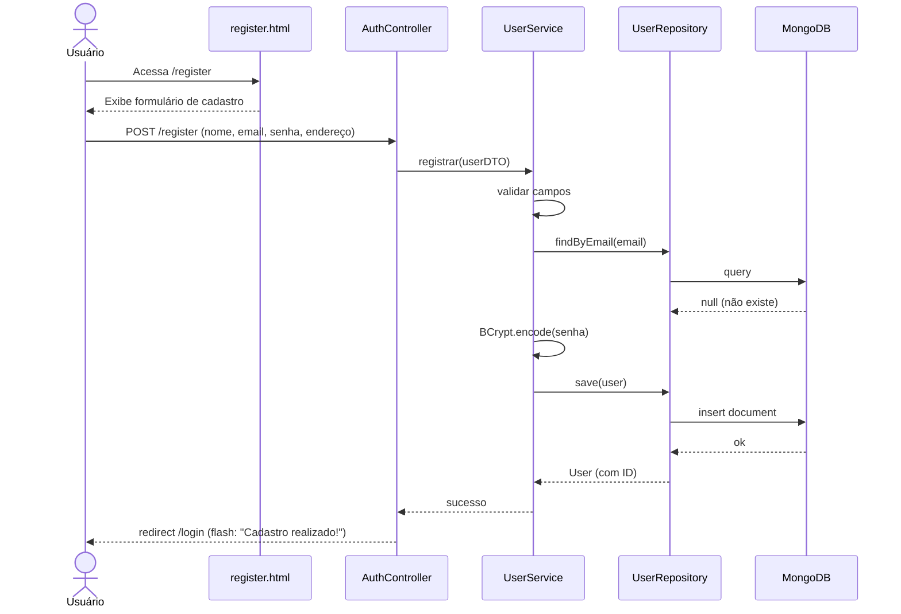
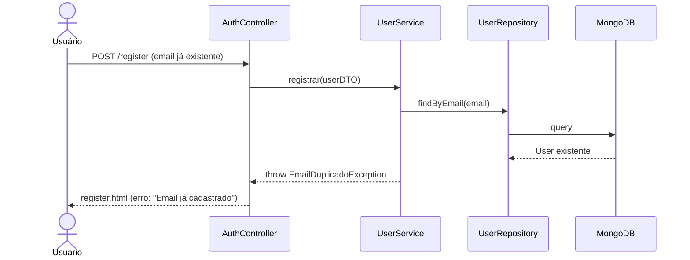

# RF-01 — Cadastro de Usuário

> **Prioridade:** Alta  
> **Módulo:** Autenticação  
> **Responsável sugerido:** Membro C (Controller + Security)

---

## 1. Descrição

Permitir que um novo usuário crie uma conta na aplicação informando **nome**, **email**, **senha** e **endereço** (com preenchimento automático via CEP — ver RF-10). Após o cadastro bem-sucedido, o usuário deve ser redirecionado para a tela de login.

---

## 2. Critérios de Aceitação

| # | Critério | Tipo |
|---|----------|------|
| CA-01 | O formulário deve exigir nome, email, senha e confirmação de senha | Obrigatório |
| CA-02 | O email deve ser único no sistema (não permitir duplicatas) | Obrigatório |
| CA-03 | A senha deve ter no mínimo 8 caracteres | Obrigatório |
| CA-04 | A senha deve ser armazenada como **hash BCrypt**, nunca em texto puro | Obrigatório |
| CA-05 | Campos de endereço devem ser preenchidos automaticamente ao digitar o CEP (RF-10) | Desejável |
| CA-06 | Exibir mensagens de erro claras para validações que falharem | Obrigatório |
| CA-07 | Após cadastro bem-sucedido, redirecionar para `/login` com mensagem de sucesso | Obrigatório |

---

## 3. Regras de Negócio

- **RN-01:** Email deve seguir formato válido (regex: `^[\w.-]+@[\w.-]+\.\w{2,}$`)
- **RN-02:** Senha e confirmação de senha devem ser idênticas
- **RN-03:** Nome não pode ser vazio ou conter apenas espaços
- **RN-04:** Se o email já existir no banco, retornar erro `"Email já cadastrado"`

---

## 4. Fluxo Principal



---

## 5. Fluxo Alternativo — Email Duplicado



---

## 6. Componentes Envolvidos

| Camada | Classe | Responsabilidade |
|--------|--------|------------------|
| **Controller** | `AuthController` | Recebe POST `/register`, delega ao service |
| **Service** | `UserService` | Valida dados, hasheia senha, persiste |
| **Repository** | `UserRepository` | `save()`, `findByEmail()` |
| **Model** | `User` | Entidade com campos: id, nome, email, senhaHash, endereco |
| **DTO** | `UserDTO` | Transferência de dados do formulário |
| **View** | `register.html` | Template Thymeleaf com formulário |

---

## 7. Estratégia de Testes

| Tipo | Classe de Teste | O que valida |
|------|----------------|--------------|
| **Integração (Testcontainers)** | `UserRepositoryIT` | Persistência real: salvar e buscar usuário no MongoDB |
| **Caixa Branca (Unitário)** | `UserServiceTest` | Lógica de hash, validação de email duplicado |
| **Caixa Preta (E2E)** | `AuthControllerTest` | POST `/register` → redirect, POST com email duplicado → erro |
| **Parametrizado** | `BookValidationParamTest` | Validação de formato de email, tamanho de senha |

---

## 8. Conexão com RNFs

| RNF | Como se aplica |
|-----|---------------|
| **RNF-01 (Testabilidade)** | Coberto por testes de integração (Testcontainers) e E2E |
| **RNF-05 (Segurança)** | Senha hasheada com BCrypt, nunca armazenada em texto puro |
| **RNF-07 (Rastreabilidade)** | Mapeado no RTM.md com todos os testes relacionados |
| **RNF-08 (Manutenibilidade)** | Segue padrão MVC: Controller → Service → Repository |

---

## 9. Modelo de Dados (MongoDB Document)

```json
{
  "_id": "ObjectId(...)",
  "nome": "João Silva",
  "email": "joao@email.com",
  "senhaHash": "$2a$10$N9qo8uLOickgx2ZMRZoMye...",
  "endereco": {
    "cep": "01001-000",
    "logradouro": "Praça da Sé",
    "bairro": "Sé",
    "cidade": "São Paulo",
    "uf": "SP",
    "numero": "123",
    "complemento": "Apto 45"
  },
  "dataCriacao": "2026-05-06T20:00:00Z"
}
```
