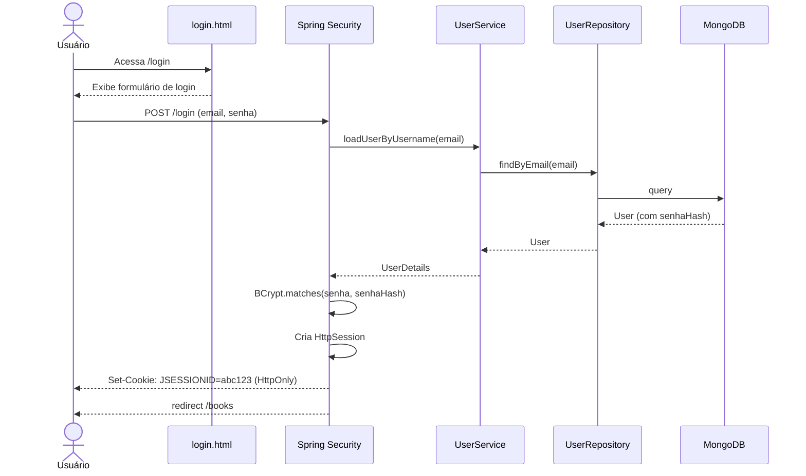
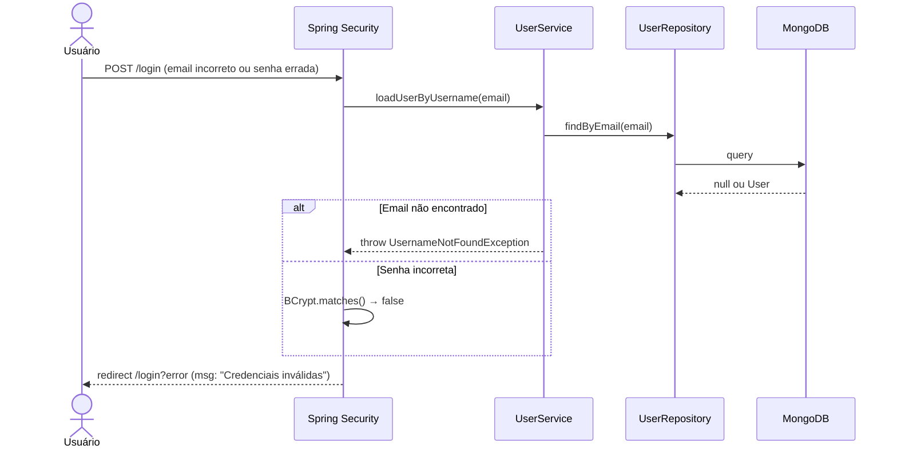

# RF-02 — Login

> **Prioridade:** Alta  
> **Módulo:** Autenticação  
> **Responsável sugerido:** Membro C (Controller + Security)

---

## 1. Descrição

Permitir que um usuário já cadastrado realize login informando **email** e **senha**. Após autenticação bem-sucedida, o sistema deve criar uma **sessão no servidor** e enviar um **cookie HttpOnly** ao navegador, redirecionando o usuário para a página de listagem de livros.

---

## 2. Critérios de Aceitação

| # | Critério | Tipo |
|---|----------|------|
| CA-01 | O formulário deve exigir email e senha | Obrigatório |
| CA-02 | O sistema deve comparar a senha digitada com o hash BCrypt armazenado | Obrigatório |
| CA-03 | Login bem-sucedido deve criar uma `HttpSession` no servidor | Obrigatório |
| CA-04 | O cookie de sessão (`JSESSIONID`) deve ser marcado como **HttpOnly** | Obrigatório |
| CA-05 | Após login, redirecionar para `/books` (listagem de livros) | Obrigatório |
| CA-06 | Email ou senha incorretos devem exibir mensagem genérica: `"Credenciais inválidas"` | Obrigatório |
| CA-07 | Não revelar se o email existe ou não (segurança contra enumeração) | Obrigatório |

---

## 3. Regras de Negócio

- **RN-01:** A comparação de senha deve usar `BCrypt.matches()` — nunca comparação direta de strings
- **RN-02:** A mensagem de erro deve ser **genérica** (`"Credenciais inválidas"`), nunca `"Email não encontrado"` ou `"Senha incorreta"` (previne enumeração de usuários)
- **RN-03:** Após 3 tentativas falhas consecutivas, considerar implementar rate limiting (desejável)
- **RN-04:** Sessão deve expirar após período de inatividade (configurável, padrão: 30 minutos)

---

## 4. Fluxo Principal — Login Bem-Sucedido



---

## 5. Fluxo Alternativo — Credenciais Inválidas



---

## 6. Componentes Envolvidos

| Camada | Classe | Responsabilidade |
|--------|--------|------------------|
| **Config** | `SecurityConfig` | Configura form login, URLs protegidas, cookie flags |
| **Service** | `UserService` (implements `UserDetailsService`) | Carrega usuário por email para o Spring Security |
| **Repository** | `UserRepository` | `findByEmail()` |
| **Model** | `User` | Entidade com senhaHash |
| **View** | `login.html` | Template Thymeleaf com formulário |

---

## 7. Configuração de Segurança (Conceitual)

```java
@Bean
SecurityFilterChain securityFilterChain(HttpSecurity http) throws Exception {
    return http
        .authorizeHttpRequests(auth -> auth
            .requestMatchers("/", "/login", "/register", "/css/**").permitAll()
            .anyRequest().authenticated()
        )
        .formLogin(form -> form
            .loginPage("/login")
            .defaultSuccessUrl("/books", true)
            .failureUrl("/login?error")
        )
        .logout(logout -> logout
            .logoutSuccessUrl("/login?logout")
            .invalidateHttpSession(true)
            .deleteCookies("JSESSIONID")
        )
        .build();
}
```

---

## 8. Estratégia de Testes

| Tipo | Classe de Teste | O que valida |
|------|----------------|--------------|
| **Integração (Testcontainers)** | `UserRepositoryIT` | `findByEmail()` retorna usuário correto do MongoDB |
| **Caixa Branca (Unitário)** | `UserServiceTest` | `loadUserByUsername()` com email existente e inexistente |
| **Caixa Preta (E2E)** | `AuthControllerTest` | POST `/login` com credenciais válidas → redirect `/books`; credenciais inválidas → `/login?error` |

---

## 9. Conexão com RNFs

| RNF | Como se aplica |
|-----|---------------|
| **RNF-05 (Segurança)** | BCrypt para comparação de senha, cookie HttpOnly, mensagem genérica de erro |
| **RNF-01 (Testabilidade)** | Testado com Testcontainers (banco real) e E2E (requisições HTTP reais) |
| **RNF-06 (Performance)** | Login deve responder em < 500ms |
| **RNF-07 (Rastreabilidade)** | Mapeado no RTM.md |

---

## 10. Detalhes do Cookie de Sessão

```
Set-Cookie: JSESSIONID=abc123def456;
            Path=/;
            HttpOnly;          ← JavaScript NÃO acessa (proteção XSS)
            Secure;            ← Só enviado via HTTPS (produção)
            SameSite=Strict;   ← Não enviado em requests cross-site (proteção CSRF)
            Max-Age=1800       ← 30 minutos de inatividade
```

> [!IMPORTANT]
> **Para a oral:** "HttpOnly impede que `document.cookie` leia o JSESSIONID. Mesmo se um atacante injetar JavaScript via XSS, ele não consegue roubar a sessão do usuário."
