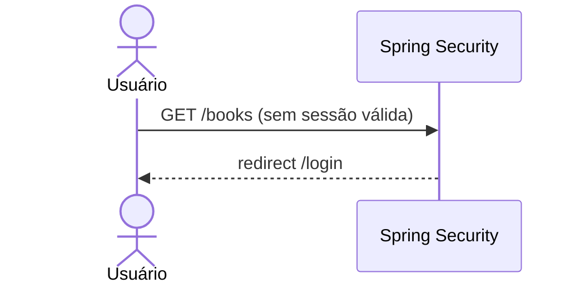

# RF-03 — Logout

> **Prioridade:** Alta  
> **Módulo:** Autenticação  
> **Responsável sugerido:** Membro C (Controller + Security)

---

## 1. Descrição

Permitir que o usuário autenticado **encerre sua sessão** de forma segura. Ao clicar em "Sair", o sistema deve **invalidar a sessão no servidor**, **apagar o cookie de sessão** no navegador e redirecionar para a tela de login.

---

## 2. Critérios de Aceitação

| # | Critério | Tipo |
|---|----------|------|
| CA-01 | O botão/link de logout deve estar visível em todas as páginas autenticadas | Obrigatório |
| CA-02 | Ao clicar em logout, a `HttpSession` deve ser invalidada no servidor | Obrigatório |
| CA-03 | O cookie `JSESSIONID` deve ser deletado do navegador | Obrigatório |
| CA-04 | Após logout, o usuário deve ser redirecionado para `/login?logout` | Obrigatório |
| CA-05 | Após logout, tentar acessar `/books` deve redirecionar para `/login` | Obrigatório |
| CA-06 | Exibir mensagem `"Você saiu com sucesso"` na tela de login após logout | Desejável |

---

## 3. Regras de Negócio

- **RN-01:** O logout deve usar método **POST** (proteção CSRF) — nunca GET
- **RN-02:** A sessão deve ser completamente destruída no servidor, não apenas o cookie removido
- **RN-03:** Após logout, o botão "Voltar" do navegador não deve permitir acesso a páginas protegidas

---

## 4. Fluxo Principal

```mermaid
sequenceDiagram
    actor U as Usuário
    participant V as layout.html
    participant SS as Spring Security
    participant SRV as Servidor (HttpSession)

    U->>V: Clica em "Sair"
    V->>SS: POST /logout (com CSRF token)
    SS->>SRV: invalidateSession()
    SRV-->>SS: Sessão destruída
    SS-->>U: Set-Cookie: JSESSIONID=; Max-Age=0 (deleta)
    SS-->>U: redirect /login?logout
    U->>V: Acessa /login
    V-->>U: "Você saiu com sucesso"
```

---

## 5. Fluxo Alternativo — Acesso Após Logout



---

## 6. Componentes Envolvidos

| Camada | Classe | Responsabilidade |
|--------|--------|------------------|
| **Config** | `SecurityConfig` | Configura `.logout()` com URL, invalidação de sessão e deleção de cookie |
| **View** | `layout.html` | Template base com botão de logout (formulário POST com CSRF) |
| **View** | `login.html` | Exibe mensagem de sucesso quando `?logout` está presente |

---

## 7. Implementação no SecurityConfig

```java
.logout(logout -> logout
    .logoutUrl("/logout")                    // URL que recebe o POST
    .logoutSuccessUrl("/login?logout")       // Redirect após sucesso
    .invalidateHttpSession(true)             // Destrói sessão no servidor
    .deleteCookies("JSESSIONID")             // Remove cookie do navegador
    .clearAuthentication(true)               // Limpa contexto de autenticação
)
```

---

## 8. Template — Botão de Logout (Thymeleaf)

```html
<!-- Em layout.html (navbar) -->
<form th:action="@{/logout}" method="post" class="d-inline">
    <button type="submit" class="btn btn-outline-danger">
        <i class="bi bi-box-arrow-right"></i> Sair
    </button>
</form>
```

> [!NOTE]
> O `th:action="@{/logout}"` injeta automaticamente o **CSRF token** como campo hidden. Isso é gerenciado pelo Spring Security.

---

## 9. Estratégia de Testes

| Tipo | Classe de Teste | O que valida |
|------|----------------|--------------|
| **Caixa Preta (E2E)** | `AuthControllerTest` | POST `/logout` → redirect `/login?logout`, sessão invalidada |
| **Caixa Preta (E2E)** | `AuthControllerTest` | Após logout, GET `/books` → redirect `/login` |

---

## 10. Conexão com RNFs

| RNF | Como se aplica |
|-----|---------------|
| **RNF-05 (Segurança)** | Sessão invalidada no servidor + cookie deletado + CSRF protection |
| **RNF-01 (Testabilidade)** | Testado com E2E (requisições HTTP reais) |
| **RNF-07 (Rastreabilidade)** | Mapeado no RTM.md |
