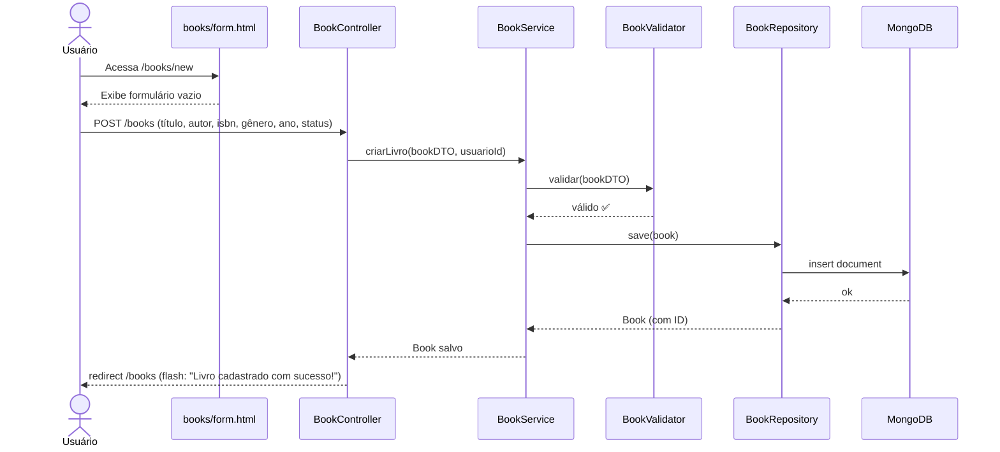
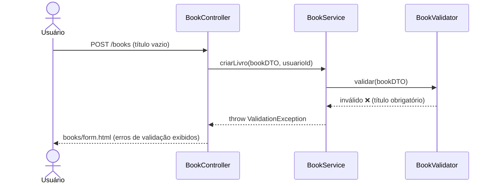

# RF-04 — Criar Livro

> **Prioridade:** Alta  
> **Módulo:** Gerenciamento de Livros  
> **Responsável sugerido:** Membro A (Model + Repository) + Membro B (Service + Validator)

---

## 1. Descrição

Permitir que um usuário autenticado **cadastre um novo livro** na sua biblioteca pessoal, informando título, autor, ISBN, gênero, ano de publicação e status de leitura. O livro deve ser associado ao usuário logado.

---

## 2. Critérios de Aceitação

| # | Critério | Tipo |
|---|----------|------|
| CA-01 | O formulário deve exigir: título, autor (campos obrigatórios) | Obrigatório |
| CA-02 | Campos opcionais: ISBN, gênero, ano de publicação, status de leitura | Obrigatório |
| CA-03 | O livro deve ser associado ao ID do usuário autenticado | Obrigatório |
| CA-04 | Status de leitura deve ter opções: `QUERO_LER`, `LENDO`, `LIDO` | Obrigatório |
| CA-05 | Após salvar, redirecionar para `/books` com mensagem `"Livro cadastrado com sucesso!"` | Obrigatório |
| CA-06 | Validações devem ser executadas antes da persistência (ver RF-11) | Obrigatório |
| CA-07 | O ano de publicação não pode ser futuro | Obrigatório |

---

## 3. Regras de Negócio

- **RN-01:** Título é obrigatório, mínimo 1 caractere, máximo 255 caracteres
- **RN-02:** Autor é obrigatório, mínimo 2 caracteres, máximo 255 caracteres
- **RN-03:** ISBN, se informado, deve seguir formato válido (ISBN-10 ou ISBN-13)
- **RN-04:** Ano de publicação deve ser entre 1450 (Gutenberg) e o ano atual
- **RN-05:** Status de leitura padrão: `QUERO_LER` (se não informado)
- **RN-06:** Cada livro pertence a **um único usuário** (não é compartilhado)

---

## 4. Fluxo Principal



---

## 5. Fluxo Alternativo — Validação Falha



---

## 6. Componentes Envolvidos

| Camada | Classe | Responsabilidade |
|--------|--------|------------------|
| **Controller** | `BookController` | Recebe POST `/books`, obtém `usuarioId` da sessão, delega ao service |
| **Service** | `BookService` | Orquestra validação e persistência |
| **Service** | `BookValidator` | Valida campos obrigatórios, formatos e regras de negócio |
| **Repository** | `BookRepository` | `save()` |
| **Model** | `Book` | Entidade com todos os campos do livro + `userId` |
| **DTO** | `BookDTO` | Transferência de dados do formulário |
| **View** | `books/form.html` | Template Thymeleaf com formulário |

---

## 7. Estratégia de Testes

| Tipo | Classe de Teste | O que valida |
|------|----------------|--------------|
| **Integração (Testcontainers)** | `BookRepositoryIT` | `save()` persiste corretamente no MongoDB; `findByUserId()` retorna apenas livros do usuário |
| **Caixa Branca (Unitário)** | `BookServiceTest` | Lógica de criação: associa userId, define status padrão |
| **Caixa Branca (Unitário)** | `BookValidatorTest` | Validações de campos obrigatórios, formato ISBN, ano válido |
| **Parametrizado** | `BookValidationParamTest` | Múltiplos cenários: título vazio, autor curto, ano futuro, ISBN inválido |
| **Caixa Preta (E2E)** | `BookControllerTest` | POST `/books` com dados válidos → redirect; dados inválidos → erros |

---

## 8. Conexão com RNFs

| RNF | Como se aplica |
|-----|---------------|
| **RNF-01 (Testabilidade)** | Coberto por 4 tipos de teste: integração, caixa branca, parametrizado e E2E |
| **RNF-06 (Performance)** | Operação de insert < 500ms |
| **RNF-07 (Rastreabilidade)** | Mapeado no RTM.md com diagrama UML |
| **RNF-08 (Manutenibilidade)** | Validação isolada em `BookValidator` (SRP) |

---

## 9. Modelo de Dados (MongoDB Document)

```json
{
  "_id": "ObjectId(...)",
  "userId": "ObjectId(...)",
  "titulo": "Dom Casmurro",
  "autor": "Machado de Assis",
  "isbn": "978-85-7326-271-4",
  "genero": "Romance",
  "anoPublicacao": 1899,
  "statusLeitura": "LIDO",
  "dataCadastro": "2026-05-06T20:00:00Z",
  "dataAtualizacao": "2026-05-06T20:00:00Z"
}
```

---

## 10. Enum — Status de Leitura

```java
public enum StatusLeitura {
    QUERO_LER("Quero Ler"),
    LENDO("Lendo"),
    LIDO("Lido");

    private final String descricao;
    // constructor + getter
}
```
