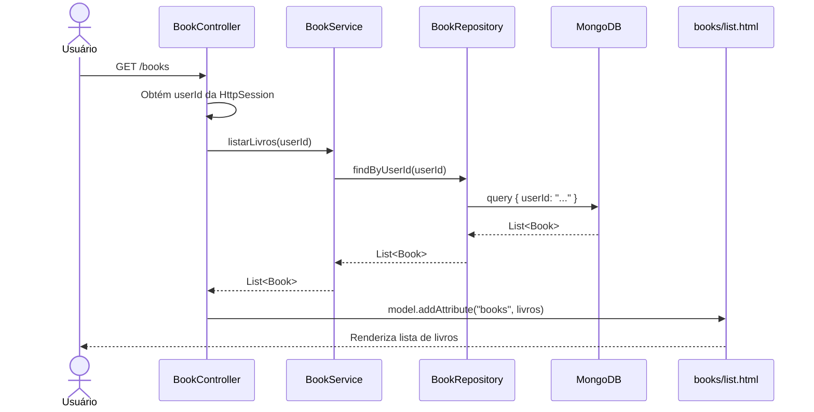
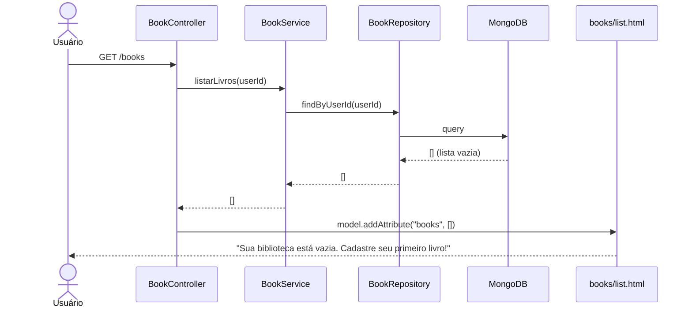

# RF-05 — Listar Livros

> **Prioridade:** Alta  
> **Módulo:** Gerenciamento de Livros  
> **Responsável sugerido:** Membro A (Templates de livros)

---

## 1. Descrição

Exibir **todos os livros pertencentes ao usuário autenticado** em uma lista organizada. A listagem é a **página principal** após o login e deve mostrar informações resumidas de cada livro, com ações rápidas para editar, excluir e ver detalhes.

---

## 2. Critérios de Aceitação

| # | Critério | Tipo |
|---|----------|------|
| CA-01 | Exibir apenas livros do usuário logado (isolamento por `userId`) | Obrigatório |
| CA-02 | Exibir: título, autor, gênero e status de leitura para cada livro | Obrigatório |
| CA-03 | Cada livro deve ter botões/links para: Ver Detalhes, Editar, Excluir | Obrigatório |
| CA-04 | Se não houver livros, exibir mensagem: `"Sua biblioteca está vazia. Cadastre seu primeiro livro!"` | Obrigatório |
| CA-05 | A lista deve ser ordenada por data de cadastro (mais recentes primeiro) | Desejável |
| CA-06 | Botão `"Novo Livro"` deve estar visível no topo da página | Obrigatório |
| CA-07 | Layout responsivo — funcionar em desktop e mobile | Obrigatório |

---

## 3. Regras de Negócio

- **RN-01:** Um usuário **nunca** deve ver livros de outro usuário
- **RN-02:** A query deve filtrar por `userId` da sessão atual
- **RN-03:** Livros excluídos (RF-08) não devem aparecer na listagem

---

## 4. Fluxo Principal



---

## 5. Fluxo Alternativo — Biblioteca Vazia



---

## 6. Componentes Envolvidos

| Camada | Classe | Responsabilidade |
|--------|--------|------------------|
| **Controller** | `BookController` | GET `/books`, obtém userId da sessão, passa lista ao template |
| **Service** | `BookService` | `listarLivros(userId)` |
| **Repository** | `BookRepository` | `findByUserId(String userId)` |
| **Model** | `Book` | Entidade |
| **View** | `books/list.html` | Template com tabela/cards de livros |

---

## 7. Template Conceitual (Thymeleaf)

```html
<!-- books/list.html -->
<div class="container">
    <h1>Minha Biblioteca</h1>
    <a th:href="@{/books/new}" class="btn btn-primary mb-3">
        <i class="bi bi-plus-circle"></i> Novo Livro
    </a>

    <!-- Lista vazia -->
    <div th:if="${#lists.isEmpty(books)}" class="alert alert-info">
        📚 Sua biblioteca está vazia. Cadastre seu primeiro livro!
    </div>

    <!-- Tabela de livros -->
    <table th:unless="${#lists.isEmpty(books)}" class="table table-hover">
        <thead>
            <tr>
                <th>Título</th>
                <th>Autor</th>
                <th>Gênero</th>
                <th>Status</th>
                <th>Ações</th>
            </tr>
        </thead>
        <tbody>
            <tr th:each="livro : ${books}">
                <td th:text="${livro.titulo}"></td>
                <td th:text="${livro.autor}"></td>
                <td th:text="${livro.genero}"></td>
                <td><span th:text="${livro.statusLeitura.descricao}" class="badge"></span></td>
                <td>
                    <a th:href="@{/books/{id}(id=${livro.id})}">Detalhes</a>
                    <a th:href="@{/books/{id}/edit(id=${livro.id})}">Editar</a>
                    <form th:action="@{/books/{id}/delete(id=${livro.id})}" method="post" class="d-inline">
                        <button type="submit" class="btn btn-sm btn-danger">Excluir</button>
                    </form>
                </td>
            </tr>
        </tbody>
    </table>
</div>
```

---

## 8. Estratégia de Testes

| Tipo | Classe de Teste | O que valida |
|------|----------------|--------------|
| **Integração (Testcontainers)** | `BookRepositoryIT` | `findByUserId()` retorna apenas livros do usuário correto |
| **Caixa Branca (Unitário)** | `BookServiceTest` | `listarLivros()` delega corretamente ao repository |
| **Caixa Preta (E2E)** | `BookControllerTest` | GET `/books` autenticado → 200 com lista; não autenticado → redirect `/login` |

---

## 9. Conexão com RNFs

| RNF | Como se aplica |
|-----|---------------|
| **RNF-01 (Testabilidade)** | Coberto por integração, caixa branca e E2E |
| **RNF-04 (Responsividade)** | Tabela responsiva com Bootstrap 5 |
| **RNF-05 (Segurança)** | Isolamento por `userId` — usuário só vê seus livros |
| **RNF-06 (Performance)** | Listagem < 500ms (índice no campo `userId` no MongoDB) |
| **RNF-07 (Rastreabilidade)** | Mapeado no RTM.md |
