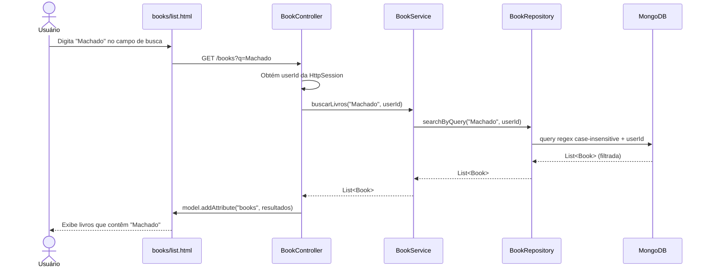

# RF-06 — Buscar Livro

> **Prioridade:** Média  
> **Módulo:** Gerenciamento de Livros  
> **Responsável sugerido:** Membro B (Service layer)

---

## 1. Descrição

Permitir que o usuário autenticado **filtre seus livros** por **título**, **autor** ou **gênero** na tela de listagem. A busca deve ser realizada no backend e retornar apenas resultados que pertencem ao usuário logado.

---

## 2. Critérios de Aceitação

| # | Critério | Tipo |
|---|----------|------|
| CA-01 | Campo de busca visível na tela de listagem de livros (`/books`) | Obrigatório |
| CA-02 | Buscar por título (parcial, case-insensitive) | Obrigatório |
| CA-03 | Buscar por autor (parcial, case-insensitive) | Obrigatório |
| CA-04 | Buscar por gênero (parcial, case-insensitive) | Obrigatório |
| CA-05 | Resultados devem ser filtrados pelo `userId` do usuário logado | Obrigatório |
| CA-06 | Se nenhum resultado for encontrado, exibir: `"Nenhum livro encontrado para sua busca"` | Obrigatório |
| CA-07 | Se o campo de busca estiver vazio, exibir todos os livros (comportamento de RF-05) | Obrigatório |

---

## 3. Regras de Negócio

- **RN-01:** A busca deve ser **case-insensitive** (ex: "dom casmurro" encontra "Dom Casmurro")
- **RN-02:** A busca deve ser **parcial** (ex: "Dom" encontra "Dom Casmurro")
- **RN-03:** A busca deve filtrar em **título OU autor OU gênero** (OR entre campos)
- **RN-04:** Resultados devem respeitar o isolamento por `userId`

---

## 4. Fluxo Principal



---

## 5. Query MongoDB (Conceitual)

```java
// No BookRepository (Spring Data MongoDB)
@Query("{ 'userId': ?1, $or: [ " +
       "{ 'titulo': { $regex: ?0, $options: 'i' } }, " +
       "{ 'autor': { $regex: ?0, $options: 'i' } }, " +
       "{ 'genero': { $regex: ?0, $options: 'i' } } " +
       "] }")
List<Book> searchByQuery(String query, String userId);
```

---

## 6. Componentes Envolvidos

| Camada | Classe | Responsabilidade |
|--------|--------|------------------|
| **Controller** | `BookController` | GET `/books?q={query}`, delega ao service |
| **Service** | `BookService` | `buscarLivros(query, userId)` |
| **Repository** | `BookRepository` | `searchByQuery()` com regex MongoDB |
| **View** | `books/list.html` | Campo de busca + resultados filtrados |

---

## 7. Estratégia de Testes

| Tipo | Classe de Teste | O que valida |
|------|----------------|--------------|
| **Integração (Testcontainers)** | `BookRepositoryIT` | `searchByQuery()` com regex funciona no MongoDB real; respeita isolamento de userId |
| **Caixa Branca (Unitário)** | `BookServiceTest` | `buscarLivros()` delega query ao repository; query vazia retorna todos |
| **Caixa Preta (E2E)** | `BookControllerTest` | GET `/books?q=Machado` → retorna livros filtrados; `?q=inexistente` → mensagem vazia |

---

## 8. Conexão com RNFs

| RNF | Como se aplica |
|-----|---------------|
| **RNF-01 (Testabilidade)** | Query regex testada com Testcontainers (MongoDB real) |
| **RNF-05 (Segurança)** | Busca filtrada por `userId` — nunca expõe livros de outros |
| **RNF-06 (Performance)** | Índice em `userId` + texto. Busca < 500ms |
| **RNF-07 (Rastreabilidade)** | Mapeado no RTM.md |
