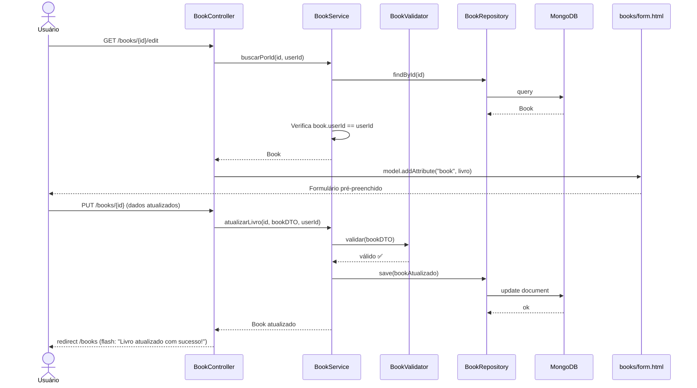
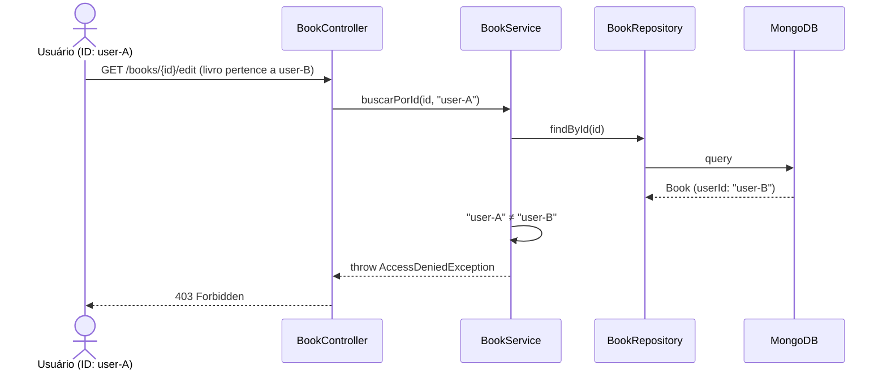

# RF-07 — Editar Livro

> **Prioridade:** Alta  
> **Módulo:** Gerenciamento de Livros  
> **Responsável sugerido:** Membro A (Templates) + Membro B (Service)

---

## 1. Descrição

Permitir que o usuário autenticado **atualize os dados** de um livro já cadastrado na sua biblioteca. O formulário de edição deve vir **pré-preenchido** com os dados atuais do livro.

---

## 2. Critérios de Aceitação

| # | Critério | Tipo |
|---|----------|------|
| CA-01 | O formulário de edição deve exibir os dados atuais do livro pré-preenchidos | Obrigatório |
| CA-02 | Todos os campos editáveis: título, autor, ISBN, gênero, ano, status de leitura | Obrigatório |
| CA-03 | As mesmas validações de criação (RF-04 / RF-11) devem ser aplicadas na edição | Obrigatório |
| CA-04 | Após salvar, redirecionar para `/books` com mensagem `"Livro atualizado com sucesso!"` | Obrigatório |
| CA-05 | O usuário só pode editar **seus próprios livros** | Obrigatório |
| CA-06 | Tentar editar livro de outro usuário deve retornar erro 403 (Forbidden) | Obrigatório |
| CA-07 | Tentar editar livro inexistente deve retornar erro 404 (Not Found) | Obrigatório |

---

## 3. Regras de Negócio

- **RN-01:** Verificar que o `userId` do livro corresponde ao `userId` da sessão antes de permitir edição
- **RN-02:** O campo `dataCadastro` não deve ser alterado — apenas `dataAtualizacao` deve ser atualizada
- **RN-03:** Validações idênticas às de criação (RF-04 / RF-11)

---

## 4. Fluxo Principal

---

## 5. Fluxo Alternativo — Livro de Outro Usuário

---

## 6. Componentes Envolvidos

| Camada | Classe | Responsabilidade |
|--------|--------|------------------|
| **Controller** | `BookController` | GET `/books/{id}/edit` (formulário) + PUT `/books/{id}` (atualização) |
| **Service** | `BookService` | Verifica propriedade, valida, atualiza |
| **Service** | `BookValidator` | Mesmas validações de RF-04 |
| **Repository** | `BookRepository` | `findById()`, `save()` |
| **View** | `books/form.html` | Mesmo template de criação, reutilizado para edição |

> [!TIP]
> O template `books/form.html` é **reutilizado** para criação (RF-04) e edição (RF-07). O Thymeleaf decide se é criação ou edição pelo objeto `book`: se `book.id` é `null` → criação; se tem valor → edição.

---

## 7. Estratégia de Testes

| Tipo | Classe de Teste | O que valida |
|------|----------------|--------------|
| **Integração (Testcontainers)** | `BookRepositoryIT` | `save()` atualiza documento existente sem duplicar |
| **Caixa Branca (Unitário)** | `BookServiceTest` | Verifica propriedade do livro; atualiza `dataAtualizacao`; rejeita edição de livro de outro usuário |
| **Caixa Preta (E2E)** | `BookControllerTest` | PUT `/books/{id}` com dados válidos → redirect; livro de outro → 403; livro inexistente → 404 |

---

## 8. Conexão com RNFs

| RNF | Como se aplica |
|-----|---------------|
| **RNF-01 (Testabilidade)** | Coberto por integração, caixa branca e E2E |
| **RNF-05 (Segurança)** | Verificação de propriedade: `book.userId == session.userId` |
| **RNF-07 (Rastreabilidade)** | Mapeado no RTM.md |
| **RNF-08 (Manutenibilidade)** | Template reutilizado entre criação e edição (DRY) |
