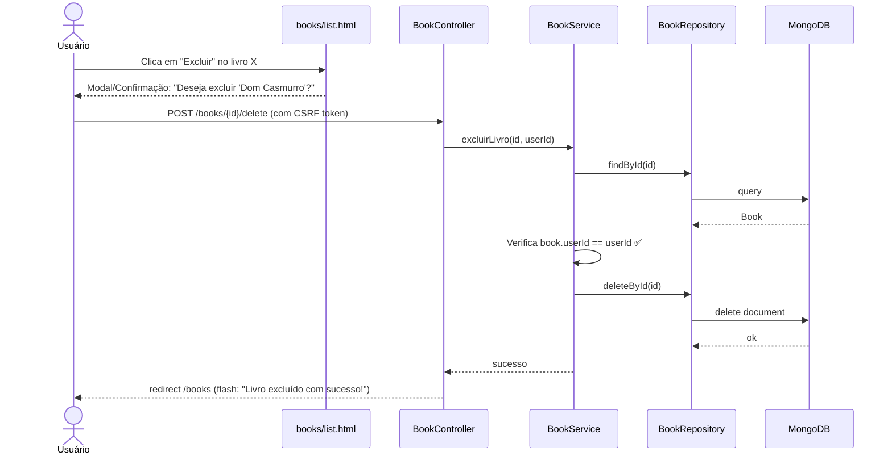
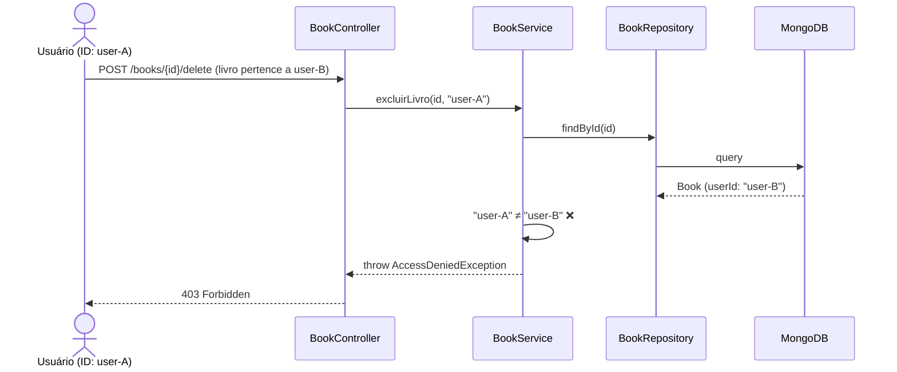

# RF-08 — Excluir Livro

> **Prioridade:** Alta  
> **Módulo:** Gerenciamento de Livros  
> **Responsável sugerido:** Membro C (Controller)

---

## 1. Descrição

Permitir que o usuário autenticado **remova um livro** da sua biblioteca pessoal. A exclusão deve ser **permanente** (hard delete) e exigir **confirmação** antes de ser executada.

---

## 2. Critérios de Aceitação

| # | Critério | Tipo |
|---|----------|------|
| CA-01 | O botão de excluir deve estar disponível na listagem de livros e na tela de detalhes | Obrigatório |
| CA-02 | Exibir **confirmação** antes de excluir (modal ou página de confirmação) | Obrigatório |
| CA-03 | O usuário só pode excluir **seus próprios livros** | Obrigatório |
| CA-04 | Tentar excluir livro de outro usuário → erro 403 (Forbidden) | Obrigatório |
| CA-05 | Tentar excluir livro inexistente → erro 404 (Not Found) | Obrigatório |
| CA-06 | Após exclusão, redirecionar para `/books` com mensagem `"Livro excluído com sucesso!"` | Obrigatório |
| CA-07 | A exclusão deve usar método **POST** ou **DELETE** (nunca GET) | Obrigatório |

---

## 3. Regras de Negócio

- **RN-01:** Verificar `book.userId == session.userId` antes de excluir
- **RN-02:** Exclusão é **hard delete** (documento removido do MongoDB) — não há soft delete neste projeto
- **RN-03:** A ação deve ser via POST (com CSRF token) para segurança

---

## 4. Fluxo Principal



---

## 5. Fluxo Alternativo — Livro de Outro Usuário



---

## 6. Componentes Envolvidos

| Camada | Classe | Responsabilidade |
|--------|--------|------------------|
| **Controller** | `BookController` | POST `/books/{id}/delete` |
| **Service** | `BookService` | Verifica propriedade, deleta |
| **Repository** | `BookRepository` | `findById()`, `deleteById()` |
| **View** | `books/list.html` | Botão de exclusão com formulário POST |

---

## 7. Template — Botão de Exclusão com Confirmação

```html
<!-- Em books/list.html -->
<form th:action="@{/books/{id}/delete(id=${livro.id})}" method="post" class="d-inline"
      onsubmit="return confirm('Deseja realmente excluir este livro?')">
    <button type="submit" class="btn btn-sm btn-danger">
        <i class="bi bi-trash"></i> Excluir
    </button>
</form>
```

---

## 8. Estratégia de Testes

| Tipo | Classe de Teste | O que valida |
|------|----------------|--------------|
| **Integração (Testcontainers)** | `BookRepositoryIT` | `deleteById()` remove documento do MongoDB; `findById()` retorna vazio após exclusão |
| **Caixa Branca (Unitário)** | `BookServiceTest` | Verifica propriedade antes de excluir; rejeita exclusão de livro de outro usuário |
| **Caixa Preta (E2E)** | `BookControllerTest` | POST `/books/{id}/delete` → redirect + livro sumiu da lista; livro de outro → 403 |

---

## 9. Conexão com RNFs

| RNF | Como se aplica |
|-----|---------------|
| **RNF-01 (Testabilidade)** | Coberto por integração, caixa branca e E2E |
| **RNF-05 (Segurança)** | Verificação de propriedade + CSRF token + POST (não GET) |
| **RNF-07 (Rastreabilidade)** | Mapeado no RTM.md |
