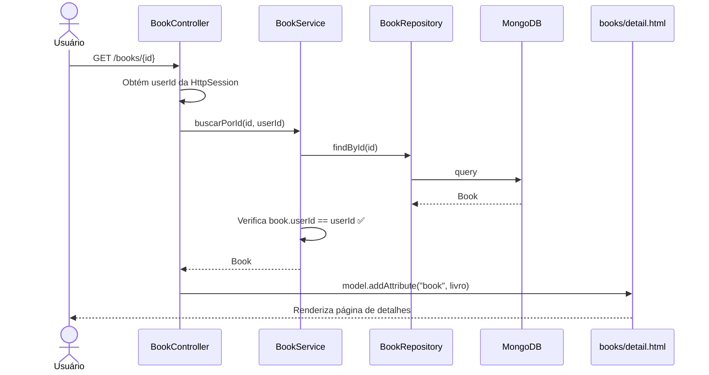

# RF-09 — Detalhes do Livro

> **Prioridade:** Média  
> **Módulo:** Gerenciamento de Livros  
> **Responsável sugerido:** Membro A (Templates de livros)

---

## 1. Descrição

Permitir que o usuário autenticado visualize **todas as informações** de um livro específico em uma página dedicada. A tela de detalhes exibe dados completos que não aparecem na listagem resumida (RF-05).

---

## 2. Critérios de Aceitação

| # | Critério | Tipo |
|---|----------|------|
| CA-01 | Exibir todos os campos: título, autor, ISBN, gênero, ano, status de leitura, data de cadastro, data de atualização | Obrigatório |
| CA-02 | O usuário só pode ver detalhes dos **seus próprios livros** | Obrigatório |
| CA-03 | Tentar acessar livro de outro usuário → erro 403 (Forbidden) | Obrigatório |
| CA-04 | Livro inexistente → erro 404 (Not Found) | Obrigatório |
| CA-05 | Botões de ação: "Editar" e "Excluir" visíveis na página de detalhes | Obrigatório |
| CA-06 | Link "Voltar para a lista" visível | Desejável |

---

## 3. Regras de Negócio

- **RN-01:** Verificar `book.userId == session.userId` antes de exibir
- **RN-02:** Campos opcionais que estão vazios (ex: ISBN não informado) devem exibir "—" ou "Não informado"
- **RN-03:** Datas devem ser formatadas no padrão brasileiro: `dd/MM/yyyy HH:mm`

---

## 4. Fluxo Principal



---

## 5. Componentes Envolvidos

| Camada | Classe | Responsabilidade |
|--------|--------|------------------|
| **Controller** | `BookController` | GET `/books/{id}`, verifica propriedade, passa ao template |
| **Service** | `BookService` | `buscarPorId(id, userId)` com verificação de propriedade |
| **Repository** | `BookRepository` | `findById()` |
| **View** | `books/detail.html` | Template Thymeleaf com detalhes completos |

---

## 6. Template Conceitual (Thymeleaf)

```html
<!-- books/detail.html -->
<div class="container">
    <h1 th:text="${book.titulo}">Título do Livro</h1>

    <div class="card">
        <div class="card-body">
            <dl class="row">
                <dt class="col-sm-3">Autor</dt>
                <dd class="col-sm-9" th:text="${book.autor}"></dd>

                <dt class="col-sm-3">ISBN</dt>
                <dd class="col-sm-9" th:text="${book.isbn ?: 'Não informado'}"></dd>

                <dt class="col-sm-3">Gênero</dt>
                <dd class="col-sm-9" th:text="${book.genero ?: 'Não informado'}"></dd>

                <dt class="col-sm-3">Ano de Publicação</dt>
                <dd class="col-sm-9" th:text="${book.anoPublicacao ?: 'Não informado'}"></dd>

                <dt class="col-sm-3">Status de Leitura</dt>
                <dd class="col-sm-9">
                    <span class="badge" th:text="${book.statusLeitura.descricao}"></span>
                </dd>

                <dt class="col-sm-3">Cadastrado em</dt>
                <dd class="col-sm-9" th:text="${#temporals.format(book.dataCadastro, 'dd/MM/yyyy HH:mm')}"></dd>

                <dt class="col-sm-3">Última atualização</dt>
                <dd class="col-sm-9" th:text="${#temporals.format(book.dataAtualizacao, 'dd/MM/yyyy HH:mm')}"></dd>
            </dl>
        </div>
    </div>

    <div class="mt-3">
        <a th:href="@{/books/{id}/edit(id=${book.id})}" class="btn btn-warning">Editar</a>
        <form th:action="@{/books/{id}/delete(id=${book.id})}" method="post" class="d-inline"
              onsubmit="return confirm('Deseja realmente excluir?')">
            <button type="submit" class="btn btn-danger">Excluir</button>
        </form>
        <a th:href="@{/books}" class="btn btn-secondary">← Voltar para a lista</a>
    </div>
</div>
```

---

## 7. Estratégia de Testes

| Tipo | Classe de Teste | O que valida |
|------|----------------|--------------|
| **Integração (Testcontainers)** | `BookRepositoryIT` | `findById()` retorna livro correto do MongoDB |
| **Caixa Branca (Unitário)** | `BookServiceTest` | `buscarPorId()` verifica propriedade; lança exceção para livro de outro usuário |
| **Caixa Preta (E2E)** | `BookControllerTest` | GET `/books/{id}` → 200 com dados; livro de outro → 403; inexistente → 404 |

---

## 8. Conexão com RNFs

| RNF | Como se aplica |
|-----|---------------|
| **RNF-01 (Testabilidade)** | Coberto por integração, caixa branca e E2E |
| **RNF-04 (Responsividade)** | Layout responsivo com Bootstrap cards |
| **RNF-05 (Segurança)** | Verificação de propriedade por `userId` |
| **RNF-07 (Rastreabilidade)** | Mapeado no RTM.md |
