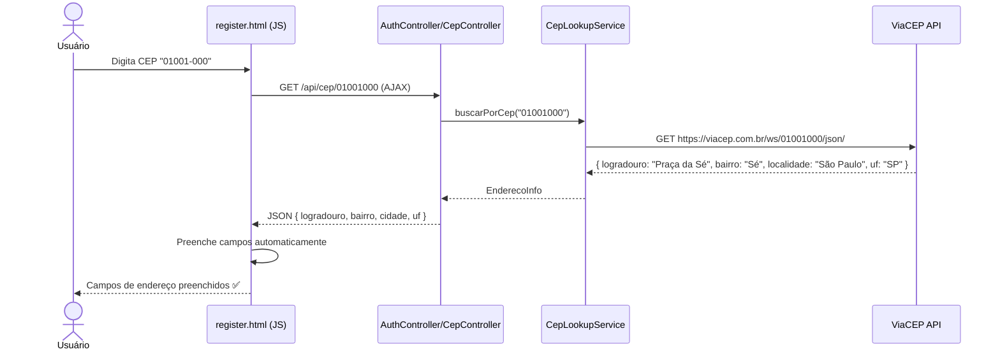
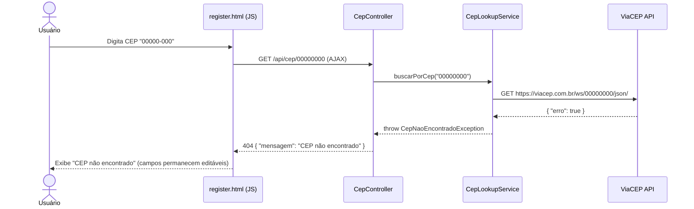
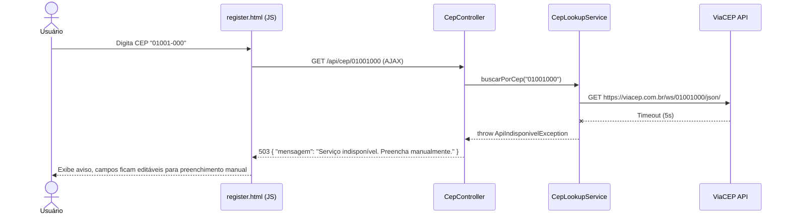

# RF-10 — Consulta de CEP (API dos Correios)

> **Prioridade:** Média  
> **Módulo:** Cadastro de Usuário / Integração Externa  
> **Responsável sugerido:** Membro B (Service + WireMock)

---

## 1. Descrição

Preencher automaticamente os campos de endereço do usuário durante o **cadastro (RF-01)** ao informar o **CEP**. O sistema consome a **API dos Correios via ViaCEP** (`viacep.com.br/ws/{cep}/json/`) para obter logradouro, bairro, cidade e UF. O usuário preenche manualmente apenas **número** e **complemento**.

> [!IMPORTANT]
> Este RF existe para justificar o uso de **WireMock/VCR** na estratégia de testes. Sem uma chamada a API externa, não haveria motivo para essa ferramenta.

---

## 2. Critérios de Aceitação

| # | Critério | Tipo |
|---|----------|------|
| CA-01 | Ao digitar um CEP válido (8 dígitos), o sistema deve buscar o endereço automaticamente | Obrigatório |
| CA-02 | Campos preenchidos automaticamente: logradouro, bairro, cidade (localidade), UF | Obrigatório |
| CA-03 | Campos manuais: número e complemento (não vêm da API) | Obrigatório |
| CA-04 | CEP inválido ou não encontrado deve exibir mensagem: `"CEP não encontrado"` | Obrigatório |
| CA-05 | Campos de endereço devem ser **editáveis** após preenchimento automático | Desejável |
| CA-06 | A busca deve funcionar sem recarregar a página (AJAX) | Desejável |
| CA-07 | Se a API estiver indisponível, permitir preenchimento manual de todos os campos | Obrigatório |

---

## 3. Regras de Negócio

- **RN-01:** CEP deve ter exatamente 8 dígitos numéricos (formato: `XXXXX-XXX` ou `XXXXXXXX`)
- **RN-02:** A busca deve ser acionada após o usuário digitar os 8 dígitos ou ao sair do campo (blur)
- **RN-03:** Se a API retornar `"erro": true`, tratar como CEP não encontrado
- **RN-04:** Timeout da chamada à API: 5 segundos (fallback para preenchimento manual)

---

## 4. API ViaCEP — Detalhes

| Item | Detalhe |
|------|---------|
| **URL** | `https://viacep.com.br/ws/{cep}/json/` |
| **Método** | GET |
| **Autenticação** | Nenhuma (API pública e gratuita) |
| **Formato de resposta** | JSON |
| **Rate limit** | Sem limite documentado |

### Exemplo de Resposta — CEP Válido

```json
{
  "cep": "01001-000",
  "logradouro": "Praça da Sé",
  "complemento": "lado ímpar",
  "unidade": "",
  "bairro": "Sé",
  "localidade": "São Paulo",
  "uf": "SP",
  "estado": "São Paulo",
  "regiao": "Sudeste",
  "ibge": "3550308",
  "gia": "1004",
  "ddd": "11",
  "siafi": "7107"
}
```

### Exemplo de Resposta — CEP Não Encontrado

```json
{
  "erro": true
}
```

---

## 5. Fluxo Principal



---

## 6. Fluxo Alternativo — CEP Não Encontrado



---

## 7. Fluxo Alternativo — API Indisponível



---

## 8. Componentes Envolvidos

| Camada | Classe | Responsabilidade |
|--------|--------|------------------|
| **Controller** | `CepController` (ou endpoint em `AuthController`) | GET `/api/cep/{cep}`, retorna JSON |
| **Service** | `CepLookupService` | Faz chamada HTTP à ViaCEP, trata resposta |
| **DTO** | `EnderecoInfo` | Transferência: logradouro, bairro, localidade, uf |
| **Config** | `RestTemplateConfig` ou `WebClientConfig` | Configuração do client HTTP com timeout |
| **View** | `register.html` | JavaScript para chamada AJAX e preenchimento dos campos |

---

## 9. Implementação Conceitual

### CepLookupService

```java
@Service
public class CepLookupService {

    private final RestTemplate restTemplate;
    private static final String VIACEP_URL = "https://viacep.com.br/ws/{cep}/json/";

    public EnderecoInfo buscarPorCep(String cep) {
        String cepLimpo = cep.replaceAll("[^0-9]", "");

        if (cepLimpo.length() != 8) {
            throw new CepInvalidoException("CEP deve ter 8 dígitos");
        }

        try {
            ResponseEntity<Map> response = restTemplate.getForEntity(
                VIACEP_URL, Map.class, cepLimpo
            );

            Map<String, Object> body = response.getBody();

            if (body.containsKey("erro")) {
                throw new CepNaoEncontradoException("CEP não encontrado");
            }

            return new EnderecoInfo(
                (String) body.get("logradouro"),
                (String) body.get("bairro"),
                (String) body.get("localidade"),
                (String) body.get("uf")
            );
        } catch (RestClientException e) {
            throw new ApiIndisponivelException("Serviço de CEP indisponível");
        }
    }
}
```

### JavaScript (AJAX no register.html)

```javascript
document.getElementById('cep').addEventListener('blur', async function() {
    const cep = this.value.replace(/\D/g, '');
    if (cep.length !== 8) return;

    try {
        const response = await fetch(`/api/cep/${cep}`);
        if (response.ok) {
            const data = await response.json();
            document.getElementById('logradouro').value = data.logradouro;
            document.getElementById('bairro').value = data.bairro;
            document.getElementById('cidade').value = data.localidade;
            document.getElementById('uf').value = data.uf;
        } else {
            alert('CEP não encontrado. Preencha manualmente.');
        }
    } catch (error) {
        alert('Serviço indisponível. Preencha manualmente.');
    }
});
```

---

## 10. Estratégia de Testes

| Tipo | Classe de Teste | O que valida |
|------|----------------|--------------|
| **Integração VCR (WireMock)** | `CepLookupServiceIT` | Gravação/replay de chamada à ViaCEP. CEP válido → EnderecoInfo preenchido. CEP inválido → exceção |
| **Parametrizado** | `CepFormatParamTest` | Validação de formato de CEP: 8 dígitos, sem letras, formatos com/sem hífen |
| **Caixa Branca (Unitário)** | `BookServiceTest` / `CepLookupServiceTest` | Tratamento de timeout, resposta de erro, limpeza de caracteres |
| **Caixa Preta (E2E)** | `AuthControllerTest` | GET `/api/cep/01001000` → 200 com JSON; `/api/cep/00000000` → 404 |

### Exemplo: WireMock/VCR

```java
@SpringBootTest
@EnableWireMock
class CepLookupServiceIT {

    @InjectWireMock
    private WireMockServer wireMock;

    @Test
    void deveBuscarEnderecoPorCep() {
        // WireMock serve a resposta gravada da ViaCEP
        EnderecoInfo endereco = cepLookupService.buscarPorCep("01001-000");
        assertEquals("Praça da Sé", endereco.getLogradouro());
        assertEquals("Sé", endereco.getBairro());
        assertEquals("São Paulo", endereco.getLocalidade());
        assertEquals("SP", endereco.getUf());
    }

    @Test
    void deveRetornarErroParaCepInvalido() {
        assertThrows(CepNaoEncontradoException.class,
            () -> cepLookupService.buscarPorCep("00000000"));
    }
}
```

### Exemplo: Testes Parametrizados

```java
@ParameterizedTest(name = "CEP \"{0}\" → válido={1}")
@CsvSource({
    "01001-000, true",
    "80010-000, true",
    "00000-000, false",
    "'', false",
    "1234, false",
    "12345-6789, false",
    "ABCDE-FGH, false"
})
void deveValidarFormatoCep(String cep, boolean esperado) {
    assertEquals(esperado, validator.isValidCep(cep));
}
```

---

## 11. Conexão com RNFs

| RNF | Como se aplica |
|-----|---------------|
| **RNF-01 (Testabilidade)** | WireMock/VCR para testes determinísticos sem rede + testes parametrizados para validação de formato |
| **RNF-06 (Performance)** | Timeout de 5s na chamada externa; fallback para manual |
| **RNF-07 (Rastreabilidade)** | Mapeado no RTM.md com diagrama UML |
| **RNF-08 (Manutenibilidade)** | `CepLookupService` isolado — fácil trocar para outra API de CEP |

---

## 12. Cassettes WireMock (Estrutura de Arquivos)

```
src/test/resources/wiremock/
├── mappings/
│   ├── cep-01001000-success.json     # CEP válido (São Paulo)
│   ├── cep-80010000-success.json     # CEP válido (Curitiba)
│   └── cep-00000000-error.json       # CEP inválido
└── __files/
    ├── cep-01001000-response.json    # Body da resposta
    ├── cep-80010000-response.json
    └── cep-00000000-response.json
```

> [!TIP]
> **Para a oral:** "WireMock não é um mock — é um servidor HTTP real que reproduz respostas gravadas. Na primeira execução, ele grava a chamada real à ViaCEP. Nas execuções seguintes, reproduz a gravação sem precisar de internet. Isso garante testes determinísticos e rápidos."
