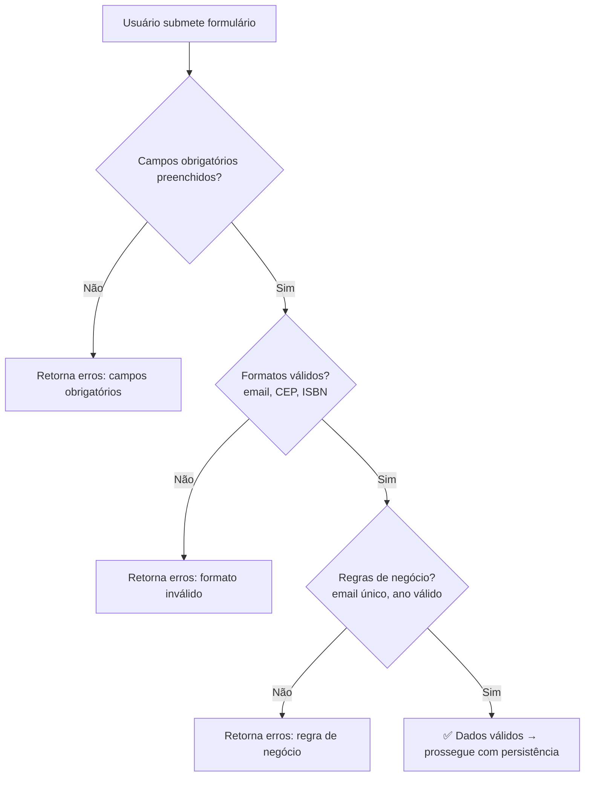

# RF-11 — Validação de Dados

> **Prioridade:** Alta  
> **Módulo:** Transversal (Livros + Usuários)  
> **Responsável sugerido:** Membro B (Validator)

---

## 1. Descrição

Validar **todos os campos obrigatórios e formatos** antes de persistir dados no banco. As validações se aplicam tanto ao cadastro de livros (RF-04, RF-07) quanto ao cadastro de usuários (RF-01). Erros de validação devem ser exibidos de forma clara no formulário.

---

## 2. Critérios de Aceitação

| # | Critério | Tipo |
|---|----------|------|
| CA-01 | Campos obrigatórios vazios devem ser rejeitados com mensagem específica | Obrigatório |
| CA-02 | Formato de email deve ser validado (regex) | Obrigatório |
| CA-03 | Formato de CEP deve ser validado (8 dígitos numéricos) | Obrigatório |
| CA-04 | Tamanho mínimo de senha: 8 caracteres | Obrigatório |
| CA-05 | Ano de publicação: entre 1450 e ano atual | Obrigatório |
| CA-06 | Título e autor: entre 1-255 caracteres | Obrigatório |
| CA-07 | Erros devem ser exibidos **ao lado do campo** correspondente no formulário | Obrigatório |
| CA-08 | Múltiplos erros devem ser exibidos simultaneamente (não parar no primeiro) | Desejável |

---

## 3. Regras de Validação Completas

### 3.1 Validações de Livro (`BookValidator`)

| Campo | Regra | Mensagem de Erro |
|-------|-------|-----------------|
| `titulo` | Obrigatório, 1-255 chars | `"Título é obrigatório"` |
| `autor` | Obrigatório, 2-255 chars | `"Autor é obrigatório (mínimo 2 caracteres)"` |
| `isbn` | Opcional; se informado, formato ISBN-10 ou ISBN-13 | `"Formato de ISBN inválido"` |
| `anoPublicacao` | Opcional; se informado, entre 1450 e ano atual | `"Ano de publicação inválido"` |
| `genero` | Opcional, máximo 100 chars | `"Gênero muito longo (máximo 100 caracteres)"` |
| `statusLeitura` | Se informado, deve ser `QUERO_LER`, `LENDO` ou `LIDO` | `"Status de leitura inválido"` |

### 3.2 Validações de Usuário

| Campo | Regra | Mensagem de Erro |
|-------|-------|-----------------|
| `nome` | Obrigatório, 2-255 chars | `"Nome é obrigatório (mínimo 2 caracteres)"` |
| `email` | Obrigatório, formato válido, único | `"Email inválido"` / `"Email já cadastrado"` |
| `senha` | Obrigatório, mínimo 8 chars | `"Senha deve ter no mínimo 8 caracteres"` |
| `confirmacaoSenha` | Deve ser igual a `senha` | `"Senhas não conferem"` |
| `cep` | Formato `XXXXX-XXX` ou `XXXXXXXX` (8 dígitos) | `"Formato de CEP inválido"` |

---

## 4. Implementação Conceitual

### BookValidator

```java
@Component
public class BookValidator {

    public void validar(BookDTO dto) {
        List<String> erros = new ArrayList<>();

        if (isBlank(dto.getTitulo())) {
            erros.add("Título é obrigatório");
        } else if (dto.getTitulo().length() > 255) {
            erros.add("Título muito longo (máximo 255 caracteres)");
        }

        if (isBlank(dto.getAutor()) || dto.getAutor().length() < 2) {
            erros.add("Autor é obrigatório (mínimo 2 caracteres)");
        }

        if (dto.getIsbn() != null && !dto.getIsbn().isEmpty()) {
            if (!isValidIsbn(dto.getIsbn())) {
                erros.add("Formato de ISBN inválido");
            }
        }

        if (dto.getAnoPublicacao() != null) {
            int anoAtual = Year.now().getValue();
            if (dto.getAnoPublicacao() < 1450 || dto.getAnoPublicacao() > anoAtual) {
                erros.add("Ano de publicação inválido");
            }
        }

        if (!erros.isEmpty()) {
            throw new ValidationException(erros);
        }
    }

    public boolean isValidCep(String cep) {
        if (cep == null || cep.isEmpty()) return false;
        String cepLimpo = cep.replaceAll("[^0-9]", "");
        if (cepLimpo.length() != 8) return false;
        return !cepLimpo.matches("^0+$"); // Rejeita "00000000"
    }
}
```

---

## 5. Exibição de Erros no Thymeleaf

```html
<!-- Exemplo: campo título com validação -->
<div class="mb-3">
    <label for="titulo" class="form-label">Título *</label>
    <input type="text" class="form-control"
           th:classappend="${#fields.hasErrors('titulo')} ? 'is-invalid'"
           th:field="*{titulo}" id="titulo">
    <div class="invalid-feedback"
         th:if="${#fields.hasErrors('titulo')}"
         th:errors="*{titulo}">
    </div>
</div>
```

---

## 6. Estratégia de Testes

| Tipo | Classe de Teste | O que valida |
|------|----------------|--------------|
| **Parametrizado** | `BookValidationParamTest` | Múltiplos cenários de validação de livro com `@CsvSource` |
| **Parametrizado** | `CepFormatParamTest` | Validação de formato de CEP com múltiplas entradas |
| **Caixa Branca (Unitário)** | `BookValidatorTest` | Todas as regras de validação isoladamente |
| **Caixa Preta (E2E)** | `BookControllerTest` | POST com dados inválidos → formulário re-exibido com erros |
| **Caixa Preta (E2E)** | `AuthControllerTest` | POST `/register` com email inválido, senha curta → erros |

### Exemplo: Teste Parametrizado de Validação de Livro

```java
@ParameterizedTest(name = "título=\"{0}\", autor=\"{1}\" → válido={2}")
@CsvSource({
    "'Dom Casmurro', 'Machado de Assis', true",
    "'', 'Machado de Assis', false",                // título vazio
    "'Dom Casmurro', '', false",                     // autor vazio
    "'Dom Casmurro', 'A', false",                    // autor < 2 chars
    "'X'.repeat(256), 'Autor', false"                // título > 255 chars
})
void deveValidarCamposObrigatorios(String titulo, String autor, boolean esperado) {
    // ...
}
```

### Exemplo: Teste Parametrizado de CEP

```java
@ParameterizedTest(name = "CEP \"{0}\" → válido={1}")
@CsvSource({
    "01001-000, true",
    "80010-000, true",
    "01001000, true",
    "00000-000, false",
    "'', false",
    "1234, false",
    "12345-6789, false",
    "ABCDE-FGH, false"
})
void deveValidarFormatoCep(String cep, boolean esperado) {
    assertEquals(esperado, validator.isValidCep(cep));
}
```

---

## 7. Conexão com RNFs

| RNF | Como se aplica |
|-----|---------------|
| **RNF-01 (Testabilidade)** | Testes parametrizados são o **melhor exemplo** para a oral — demonstram múltiplos cenários com `@CsvSource` |
| **RNF-02 (Qualidade de Código)** | Validação centralizada em `BookValidator` (SRP), sem duplicação |
| **RNF-07 (Rastreabilidade)** | Mapeado no RTM.md |
| **RNF-08 (Manutenibilidade)** | Validator separado do Service — fácil adicionar novas regras |

---

## 8. Diagrama de Fluxo de Validação



> [!TIP]
> **Para a oral:** "Testes parametrizados com `@CsvSource` nos permitem testar **N cenários** com **uma única asserção**, garantindo cobertura ampla com código enxuto. Cada linha do CSV é um caso de teste independente."
