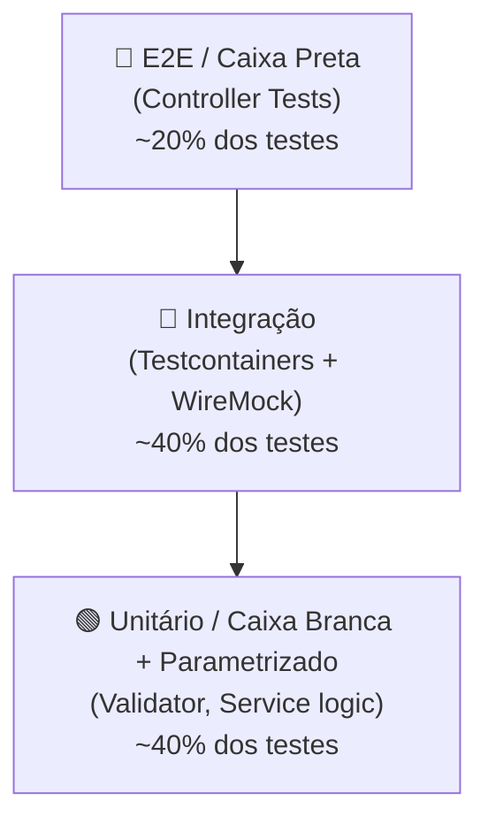

# RNF-01 — Testabilidade

> **Métrica:** ≥ 80% de cobertura de linhas  
> **Ferramenta de Verificação:** JaCoCo  
> **Prioridade:** Alta

---

## 1. Descrição

O projeto deve atingir **cobertura mínima de 80%** de linhas de código, medida pelo **JaCoCo**. A testabilidade não se limita à cobertura — o projeto deve demonstrar **diversidade de tipos de teste** e **ausência de mocks tradicionais**.

---

## 2. Critérios de Verificação

| # | Critério | Tipo |
|---|----------|------|
| CV-01 | Relatório JaCoCo gerado automaticamente em cada build (`mvn verify`) | Obrigatório |
| CV-02 | Cobertura de linhas ≥ 80% no relatório | Obrigatório |
| CV-03 | Quality Gate do SonarCloud configurado para rejeitar < 80% | Obrigatório |
| CV-04 | **Zero mocks** — apenas Testcontainers e WireMock | Obrigatório |
| CV-05 | Presença de pelo menos 4 tipos de teste: integração, caixa branca, caixa preta, parametrizado | Obrigatório |

---

## 3. Tipos de Teste Exigidos

| Tipo | Ferramenta | Onde se aplica | Exemplo |
|------|------------|----------------|---------|
| **Integração** | Testcontainers + MongoDB | Repository + Service | `BookRepositoryIT`: CRUD com banco real |
| **Caixa Branca (Unitário)** | JUnit 5 + Testcontainers | Service | `BookServiceTest`: lógica de negócio |
| **Caixa Preta (E2E)** | SpringBootTest + TestRestTemplate | Controller | `BookControllerTest`: HTTP real |
| **Parametrizado** | JUnit 5 `@ParameterizedTest` | Validator | `BookValidationParamTest`: múltiplos cenários |
| **Integração VCR** | WireMock | API externa | `CepLookupServiceIT`: replay ViaCEP |

---

## 4. Regra: Zero Mocks

> [!CAUTION]
> **Proibido pelo professor:** `@Mock`, `@MockBean`, `Mockito.when()`. O projeto deve usar exclusivamente:
> - **Testcontainers** para persistência (MongoDB real em Docker)
> - **WireMock** para APIs externas (servidor HTTP real com gravações)

### Por que?

| Mocks tradicionais | Testcontainers/WireMock |
|--------------------|------------------------|
| Testam o **mock**, não o código real | Testam contra **infraestrutura real** |
| Escondem bugs de query, serialização | Revelam problemas reais de integração |
| Dão falsa segurança de cobertura | Cobertura reflete comportamento real |

---

## 5. Pirâmide de Testes do Projeto



---

## 6. Configuração JaCoCo (pom.xml)

```xml
<plugin>
    <groupId>org.jacoco</groupId>
    <artifactId>jacoco-maven-plugin</artifactId>
    <version>0.8.11</version>
    <executions>
        <execution>
            <goals><goal>prepare-agent</goal></goals>
        </execution>
        <execution>
            <id>report</id>
            <phase>verify</phase>
            <goals><goal>report</goal></goals>
        </execution>
        <execution>
            <id>check</id>
            <phase>verify</phase>
            <goals><goal>check</goal></goals>
            <configuration>
                <rules>
                    <rule>
                        <element>BUNDLE</element>
                        <limits>
                            <limit>
                                <counter>LINE</counter>
                                <value>COVEREDRATIO</value>
                                <minimum>0.80</minimum>
                            </limit>
                        </limits>
                    </rule>
                </rules>
            </configuration>
        </execution>
    </executions>
</plugin>
```

---

## 7. Mapa: RFs × Tipos de Teste

| RF | Integração | Caixa Branca | Caixa Preta | Parametrizado | VCR |
|----|:---:|:---:|:---:|:---:|:---:|
| RF-01 Cadastro | ✅ | ✅ | ✅ | ✅ | — |
| RF-02 Login | ✅ | ✅ | ✅ | — | — |
| RF-03 Logout | — | — | ✅ | — | — |
| RF-04 Criar Livro | ✅ | ✅ | ✅ | ✅ | — |
| RF-05 Listar | ✅ | ✅ | ✅ | — | — |
| RF-06 Buscar | ✅ | ✅ | ✅ | — | — |
| RF-07 Editar | ✅ | ✅ | ✅ | — | — |
| RF-08 Excluir | ✅ | ✅ | ✅ | — | — |
| RF-09 Detalhes | ✅ | ✅ | ✅ | — | — |
| RF-10 CEP API | — | ✅ | ✅ | ✅ | ✅ |
| RF-11 Validação | — | ✅ | ✅ | ✅ | — |

---

## 8. Como Verificar a Cobertura

```bash
# Gerar relatório JaCoCo
mvn clean verify

# Abrir relatório HTML
# → target/site/jacoco/index.html
```

> [!TIP]
> **Para a oral:** "Cobertura de 80% não significa que o software é perfeito. Significa que 80% das linhas foram executadas durante os testes. O que importa é a **qualidade** dos testes, não apenas a quantidade. Por isso usamos Testcontainers e WireMock — eles garantem que os testes refletem cenários reais."
