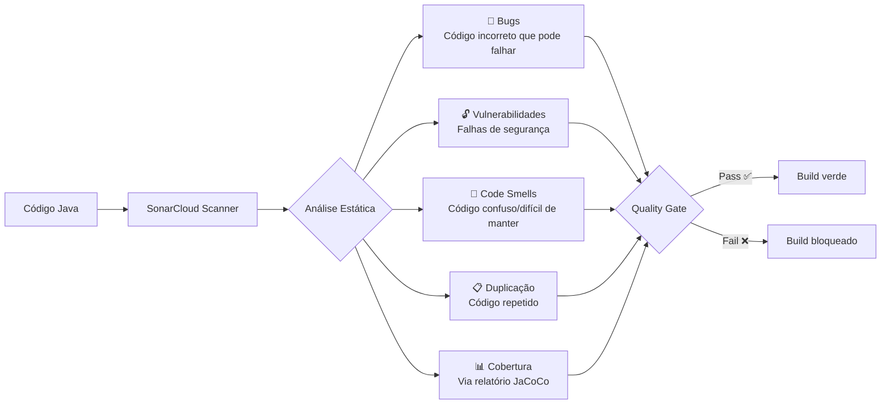

# RNF-02 — Qualidade de Código

> **Métrica:** Zero bugs críticos, zero vulnerabilidades  
> **Ferramenta de Verificação:** SonarQube (via SonarCloud)  
> **Prioridade:** Alta

---

## 1. Descrição

O código-fonte deve manter **zero bugs críticos** e **zero vulnerabilidades de segurança**, verificado automaticamente pelo **SonarCloud**. O projeto deve passar no **Quality Gate** padrão do SonarCloud em cada push.

---

## 2. Critérios de Verificação

| # | Critério | Tipo |
|---|----------|------|
| CV-01 | Quality Gate do SonarCloud passando (verde) | Obrigatório |
| CV-02 | Zero bugs com severidade Critical ou Blocker | Obrigatório |
| CV-03 | Zero vulnerabilidades de segurança | Obrigatório |
| CV-04 | Code smells ≤ 10 (desejável ≤ 5) | Desejável |
| CV-05 | Duplicação de código < 3% | Desejável |
| CV-06 | Complexidade ciclomática por método ≤ 10 | Desejável |

---

## 3. Quality Gate — Condições

| Métrica | Condição | Ferramenta |
|---------|----------|------------|
| **Cobertura** | ≥ 80% em novo código | JaCoCo → SonarCloud |
| **Bugs** | 0 novos | SonarCloud |
| **Vulnerabilidades** | 0 novas | SonarCloud |
| **Code Smells** | Rating A (≤ 5% dívida técnica) | SonarCloud |
| **Duplicação** | < 3% em novo código | SonarCloud |

---

## 4. O que o SonarCloud Analisa



---

## 5. Exemplos de Issues que o SonarCloud Detecta

### Bugs

| Exemplo | Severidade |
|---------|-----------|
| `NullPointerException` potencial (variável usada sem verificação) | Critical |
| Comparação de String com `==` em vez de `.equals()` | Major |
| Recurso não fechado (`InputStream`, `Connection`) | Blocker |

### Vulnerabilidades

| Exemplo | Severidade |
|---------|-----------|
| Senha hardcoded no código | Blocker |
| SQL/NoSQL injection | Critical |
| Cookie sem flag `HttpOnly` | Major |

### Code Smells

| Exemplo | Severidade |
|---------|-----------|
| Método com complexidade ciclomática > 10 | Major |
| Classe com > 500 linhas | Major |
| Variável não utilizada | Minor |
| Catch genérico `catch (Exception e)` | Minor |

---

## 6. Configuração

### sonar-project.properties

```properties
sonar.projectKey=biblioteca-pessoal
sonar.organization=equipe-trio
sonar.sources=src/main/java
sonar.tests=src/test/java
sonar.java.binaries=target/classes
sonar.coverage.jacoco.xmlReportPaths=target/site/jacoco/jacoco.xml
```

### GitHub Actions (CI)

```yaml
- name: SonarCloud Analysis
  uses: SonarSource/sonarcloud-github-action@master
  env:
    GITHUB_TOKEN: ${{ secrets.GITHUB_TOKEN }}
    SONAR_TOKEN: ${{ secrets.SONAR_TOKEN }}
```

---

## 7. RFs Impactados

| RF | Como RNF-02 se aplica |
|----|-----------------------|
| **Todos** | Código de todos os RFs é analisado pelo SonarCloud |
| **RF-01, RF-02** | Vulnerabilidades de autenticação detectadas (senha, sessão) |
| **RF-10** | Chamadas HTTP sem tratamento de exceção detectadas como bugs |
| **RF-11** | Validações com lógica complexa podem gerar code smells |

---

## 8. Conexão com outros RNFs

| RNF | Relação |
|-----|---------|
| **RNF-01 (Testabilidade)** | SonarCloud usa relatório JaCoCo para exibir cobertura na dashboard |
| **RNF-03 (CI/CD)** | Análise SonarCloud roda automaticamente no pipeline |
| **RNF-05 (Segurança)** | SonarCloud detecta vulnerabilidades de segurança |
| **RNF-08 (Manutenibilidade)** | Code smells medem a manutenibilidade |

> [!TIP]
> **Para a oral:** "SonarQube não é um linter simples. Ele faz análise estática profunda — detecta bugs potenciais em runtime, vulnerabilidades de segurança e mede a dívida técnica do projeto. O Quality Gate funciona como um 'porteiro': se o código não atinge os critérios, o build é bloqueado."
