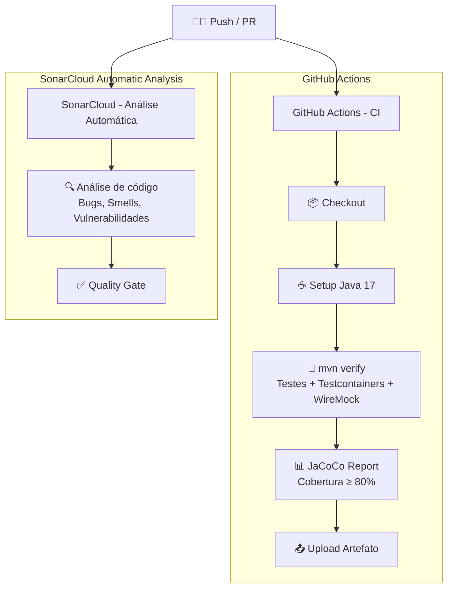
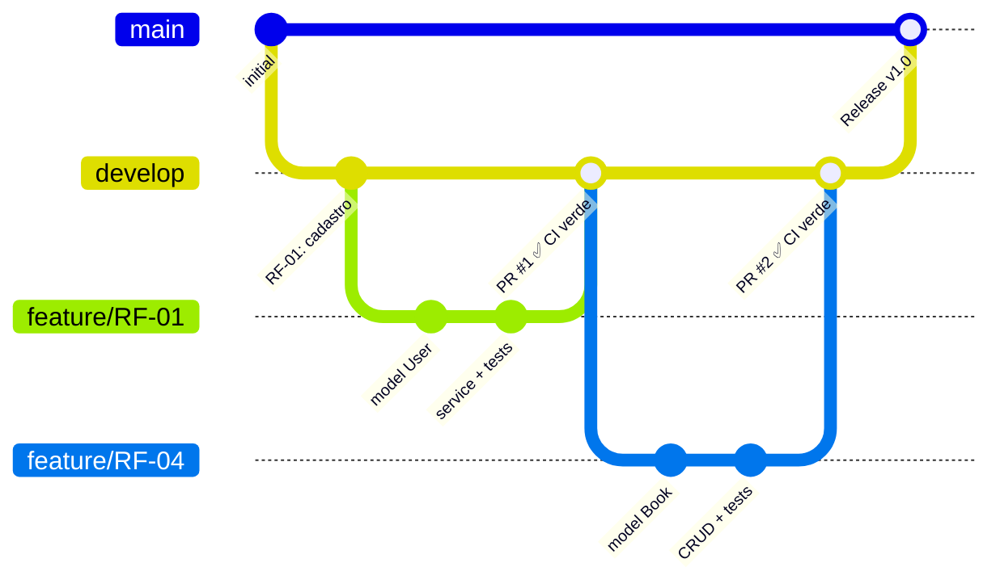

# RNF-03 — CI/CD (Integração e Entrega Contínua)

> **Métrica:** Pipeline verde a cada push  
> **Ferramenta de Verificação:** GitHub Actions  
> **Prioridade:** Alta

---

## 1. Descrição

O projeto deve ter um **pipeline automatizado** que executa build, testes e análise de qualidade **a cada push ou pull request**. O pipeline deve ser verde (sem falhas) para que o código seja aceito na branch principal.

---

## 2. Critérios de Verificação

| # | Critério | Tipo |
|---|----------|------|
| CV-01 | Pipeline executa automaticamente a cada push e pull request | Obrigatório |
| CV-02 | Build compila sem erros (`mvn compile`) | Obrigatório |
| CV-03 | Todos os testes passam (`mvn verify`) | Obrigatório |
| CV-04 | Testcontainers funciona no CI (Docker disponível) | Obrigatório |
| CV-05 | WireMock reproduz cassettes no CI (sem rede necessária) | Obrigatório |
| CV-06 | Relatório JaCoCo gerado e enviado ao SonarCloud | Obrigatório |
| CV-07 | Quality Gate do SonarCloud verificado | Obrigatório |
| CV-08 | Pipeline completo executa em < 10 minutos | Desejável |

---

## 3. Arquitetura de Verificação

O projeto utiliza **duas verificações independentes e automáticas** que rodam em paralelo a cada push:



| Responsabilidade | Quem executa | Disparador |
|---|---|---|
| Build, testes, cobertura (JaCoCo ≥ 80%) | **GitHub Actions** (CI) | Push / PR |
| Análise estática (bugs, smells, segurança) | **SonarCloud** (Automático) | Push |

> [!NOTE]
> O SonarCloud utiliza **Automatic Analysis**, que analisa o código diretamente do repositório sem necessidade de um job separado no CI. Isso evita conflitos entre análise CI-based e automática, além de simplificar o pipeline.

---

## 4. Configuração — ci.yml (GitHub Actions)

```yaml
# .github/workflows/ci.yml
name: CI — Biblioteca Pessoal

on:
  push:
    branches: [main, develop]
  pull_request:
    branches: [main]

jobs:
  build-and-test:
    runs-on: ubuntu-latest

    steps:
      - name: Checkout
        uses: actions/checkout@v4

      - name: Setup Java 17
        uses: actions/setup-java@v4
        with:
          distribution: temurin
          java-version: '17'
          cache: maven

      - name: Build e Testes
        run: mvn verify -B -q

      - name: Upload JaCoCo Report
        if: always()
        uses: actions/upload-artifact@v4
        with:
          name: jacoco-report
          path: target/site/jacoco/
```

### Configuração — SonarCloud (Automatic Analysis)

A análise do SonarCloud é configurada diretamente no painel do SonarCloud com **Automatic Analysis habilitado** (Administration → Analysis Method). O arquivo `sonar-project.properties` na raiz do projeto define os parâmetros:

```properties
sonar.projectKey=Huguius_Projeto_Semestral
sonar.organization=1projeto
sonar.sources=src/main/java,src/main/resources
sonar.tests=src/test/java
sonar.java.binaries=target/classes
sonar.sourceEncoding=UTF-8
sonar.java.source=17
```

---

## 5. Dependências do Pipeline

### GitHub Actions (CI)

| Passo | Depende de | Ferramenta |
|-------|-----------|------------|
| Build | Java 17 + Maven | `actions/setup-java` |
| Testes de integração | Docker (para Testcontainers) | `ubuntu-latest` já inclui Docker |
| Testes WireMock | WireMock standalone (in-memory) | Dependência no `pom.xml` |
| Cobertura | Plugin JaCoCo no `pom.xml` | `jacoco-maven-plugin` (≥ 80%) |

### SonarCloud (Automatic Analysis)

| Passo | Depende de | Configuração |
|-------|-----------|------------|
| Análise automática | Automatic Analysis habilitado | SonarCloud → Administration → Analysis Method |
| Parâmetros | `sonar-project.properties` na raiz | Versionado no Git |
| Templates Thymeleaf | `src/main/resources` em `sonar.sources` | Detecta vulnerabilidades XSS |

---

## 6. Branch Strategy



| Branch | Propósito | Quem mergeia |
|--------|----------|--------------|
| `main` | Código estável, pronto para entrega | Merge de `develop` quando estável |
| `develop` | Integração de features | PRs de feature branches |
| `feature/RF-XX` | Desenvolvimento de cada RF | Cada membro trabalha em sua branch |

---

## 7. RFs Impactados

Todos os RFs são impactados — o pipeline valida **todo o código** a cada push.

---

## 8. Conexão com outros RNFs

| RNF | Relação |
|-----|---------|
| **RNF-01 (Testabilidade)** | Pipeline executa todos os testes e verifica cobertura |
| **RNF-02 (Qualidade)** | Pipeline inclui análise SonarCloud |
| **RNF-07 (Rastreabilidade)** | Pipeline garante que testes estão sempre passando |

> [!TIP]
> **Para a oral:** "GitHub Actions é serverless — não precisamos manter um servidor Jenkins. O pipeline roda em containers Ubuntu com Docker pré-instalado, o que é essencial para o Testcontainers funcionar. O custo é zero para repositórios públicos."
