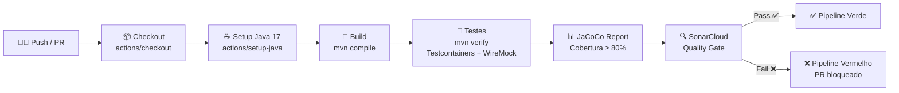
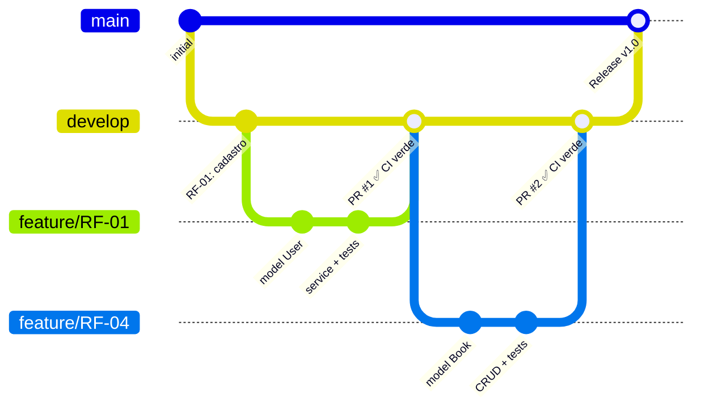

# RNF-03 — CI/CD (Integração e Entrega Contínua)

> **Métrica:** Pipeline verde a cada push  
> **Ferramenta de Verificação:** GitHub Actions  
> **Prioridade:** Alta

---

## 1. Descrição

O projeto deve ter um **pipeline automatizado** que executa build, testes e análise de qualidade **a cada push ou pull request**. O pipeline deve ser verde (sem falhas) para que o código seja aceito na branch principal.

---

## 2. Critérios de Verificação

| # | Critério | Tipo |
|---|----------|------|
| CV-01 | Pipeline executa automaticamente a cada push e pull request | Obrigatório |
| CV-02 | Build compila sem erros (`mvn compile`) | Obrigatório |
| CV-03 | Todos os testes passam (`mvn verify`) | Obrigatório |
| CV-04 | Testcontainers funciona no CI (Docker disponível) | Obrigatório |
| CV-05 | WireMock reproduz cassettes no CI (sem rede necessária) | Obrigatório |
| CV-06 | Relatório JaCoCo gerado e enviado ao SonarCloud | Obrigatório |
| CV-07 | Quality Gate do SonarCloud verificado | Obrigatório |
| CV-08 | Pipeline completo executa em < 10 minutos | Desejável |

---

## 3. Fluxo do Pipeline



---

## 4. Configuração Completa — ci.yml

```yaml
# .github/workflows/ci.yml
name: CI Pipeline

on:
  push:
    branches: [main, develop]
  pull_request:
    branches: [main]

jobs:
  build-and-test:
    runs-on: ubuntu-latest

    steps:
      - name: Checkout código
        uses: actions/checkout@v4
        with:
          fetch-depth: 0  # Necessário para SonarCloud

      - name: Setup Java 17
        uses: actions/setup-java@v4
        with:
          java-version: '17'
          distribution: 'temurin'
          cache: 'maven'

      - name: Build & Test (Testcontainers + WireMock)
        run: mvn clean verify

      - name: SonarCloud Analysis
        uses: SonarSource/sonarcloud-github-action@master
        env:
          GITHUB_TOKEN: ${{ secrets.GITHUB_TOKEN }}
          SONAR_TOKEN: ${{ secrets.SONAR_TOKEN }}
```

---

## 5. Dependências do Pipeline

| Passo | Depende de | Ferramenta |
|-------|-----------|------------|
| Build | Java 17 + Maven | `actions/setup-java` |
| Testes de integração | Docker (para Testcontainers) | `ubuntu-latest` já inclui Docker |
| Testes VCR | Cassettes WireMock em `src/test/resources/wiremock/` | Arquivos versionados no Git |
| Cobertura | Plugin JaCoCo no `pom.xml` | `jacoco-maven-plugin` |
| Qualidade | Projeto configurado no SonarCloud + token | `SONAR_TOKEN` secret |

---

## 6. Branch Strategy



| Branch | Propósito | Quem mergeia |
|--------|----------|--------------|
| `main` | Código estável, pronto para entrega | Merge de `develop` quando estável |
| `develop` | Integração de features | PRs de feature branches |
| `feature/RF-XX` | Desenvolvimento de cada RF | Cada membro trabalha em sua branch |

---

## 7. RFs Impactados

Todos os RFs são impactados — o pipeline valida **todo o código** a cada push.

---

## 8. Conexão com outros RNFs

| RNF | Relação |
|-----|---------|
| **RNF-01 (Testabilidade)** | Pipeline executa todos os testes e verifica cobertura |
| **RNF-02 (Qualidade)** | Pipeline inclui análise SonarCloud |
| **RNF-07 (Rastreabilidade)** | Pipeline garante que testes estão sempre passando |

> [!TIP]
> **Para a oral:** "GitHub Actions é serverless — não precisamos manter um servidor Jenkins. O pipeline roda em containers Ubuntu com Docker pré-instalado, o que é essencial para o Testcontainers funcionar. O custo é zero para repositórios públicos."
