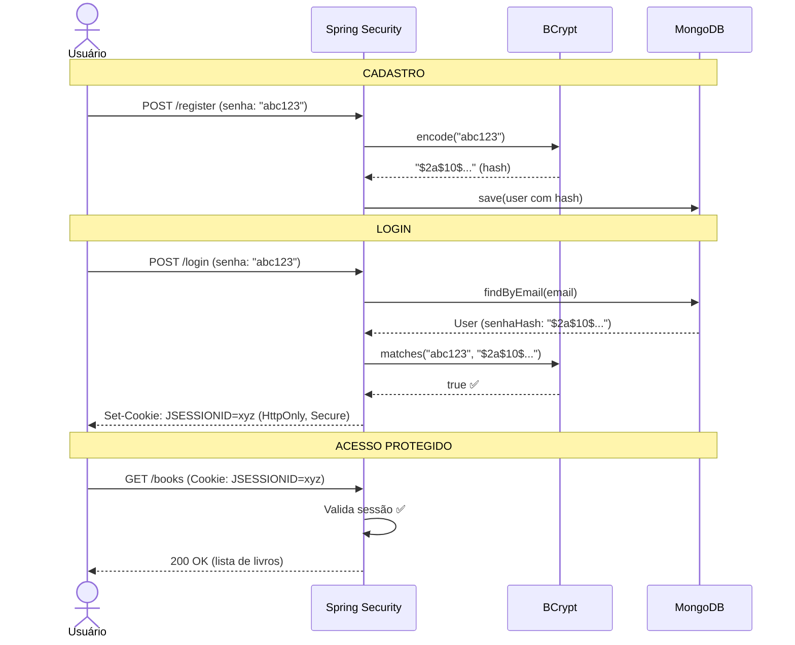

# RNF-05 — Segurança

> **Métrica:** Senhas hasheadas, sessão segura  
> **Ferramenta de Verificação:** BCrypt + HttpOnly cookies + Spring Security  
> **Prioridade:** Alta

---

## 1. Descrição

O sistema deve garantir **armazenamento seguro de senhas**, **gerenciamento seguro de sessões** e **proteção contra ataques comuns** (XSS, CSRF, enumeração de usuários). A segurança é implementada via **Spring Security**.

---

## 2. Critérios de Verificação

| # | Critério | Tipo |
|---|----------|------|
| CV-01 | Senhas armazenadas como hash BCrypt (nunca texto puro) | Obrigatório |
| CV-02 | Cookie de sessão marcado como **HttpOnly** | Obrigatório |
| CV-03 | Cookie de sessão marcado como **Secure** (em produção) | Obrigatório |
| CV-04 | Proteção CSRF ativada (token em formulários) | Obrigatório |
| CV-05 | Mensagens de erro de login genéricas ("Credenciais inválidas") | Obrigatório |
| CV-06 | Páginas protegidas redirecionam para `/login` se não autenticado | Obrigatório |
| CV-07 | Isolamento de dados: usuário só acessa seus próprios livros | Obrigatório |
| CV-08 | SonarCloud sem vulnerabilidades detectadas | Obrigatório |

---

## 3. Pilares de Segurança

### 3.1 BCrypt — Armazenamento de Senhas

```
Senha → BCrypt.encode() → $2a$10$N9qo8uLOickgx2ZMRZoMye...
                            │    │   └── Hash + Salt (60 chars)
                            │    └── Cost factor (2^10 = 1024 iterações)
                            └── Versão do algoritmo
```

| Propriedade | Valor |
|-------------|-------|
| **Algoritmo** | BCrypt (Blowfish-based) |
| **Cost factor** | 10 (padrão Spring Security) |
| **Salt** | Automático, único por senha |
| **Reversível?** | **Não** — é um hash, não criptografia |

**Por que não MD5/SHA?**

| | BCrypt | MD5/SHA-256 |
|--|--------|-------------|
| **Velocidade** | Propositalmente **lento** (~100ms) | Ultrarrápido (~1µs) |
| **Brute force** | ~10 tentativas/segundo | ~bilhões/segundo |
| **Salt** | Automático e embutido no hash | Manual (frequentemente esquecido) |
| **Resultado** | Mesma senha → hashes **diferentes** | Mesma senha → hash **idêntico** |

---

### 3.2 HttpOnly Cookies — Proteção de Sessão

```
Set-Cookie: JSESSIONID=abc123;
            Path=/;
            HttpOnly;          ← JS não acessa (XSS protection)
            Secure;            ← Só HTTPS (sniffing protection)
            SameSite=Strict;   ← Não cross-site (CSRF protection)
```

| Flag | Protege contra | Ataque |
|------|---------------|--------|
| **HttpOnly** | `document.cookie` no JS | XSS (Cross-Site Scripting) |
| **Secure** | Interceptação em HTTP | Sniffing em redes públicas |
| **SameSite=Strict** | Requests de outros sites | CSRF (Cross-Site Request Forgery) |

---

### 3.3 CSRF Protection — Spring Security

```html
<!-- Thymeleaf injeta automaticamente -->
<form th:action="@{/books}" method="post">
    <!-- Hidden input gerado pelo Spring Security: -->
    <input type="hidden" name="_csrf" value="token-aleatorio-abc123">
    <!-- ... campos do formulário ... -->
</form>
```

| Sem CSRF protection | Com CSRF protection |
|--------------------|---------------------|
| Site malicioso pode enviar POST para `/books/1/delete` | Token único por sessão valida que o request é legítimo |

---

### 3.4 Isolamento de Dados por Usuário

```java
// Em BookService — SEMPRE filtra por userId
public List<Book> listarLivros(String userId) {
    return bookRepository.findByUserId(userId);  // Nunca findAll()
}

public Book buscarPorId(String id, String userId) {
    Book book = bookRepository.findById(id)
        .orElseThrow(() -> new NotFoundException("Livro não encontrado"));

    if (!book.getUserId().equals(userId)) {
        throw new AccessDeniedException("Acesso negado");  // 403
    }

    return book;
}
```

---

## 4. Fluxo de Autenticação Seguro



---

## 5. Configuração Spring Security

```java
@Configuration
@EnableWebSecurity
public class SecurityConfig {

    @Bean
    public PasswordEncoder passwordEncoder() {
        return new BCryptPasswordEncoder();  // Cost factor 10
    }

    @Bean
    public SecurityFilterChain filterChain(HttpSecurity http) throws Exception {
        return http
            .authorizeHttpRequests(auth -> auth
                .requestMatchers("/", "/login", "/register", "/css/**", "/js/**").permitAll()
                .requestMatchers("/api/cep/**").permitAll()  // CEP lookup público
                .anyRequest().authenticated()
            )
            .formLogin(form -> form
                .loginPage("/login")
                .defaultSuccessUrl("/books", true)
                .failureUrl("/login?error")
            )
            .logout(logout -> logout
                .logoutSuccessUrl("/login?logout")
                .invalidateHttpSession(true)
                .deleteCookies("JSESSIONID")
            )
            .build();
    }
}
```

---

## 6. RFs Impactados

| RF | Como RNF-05 se aplica |
|----|-----------------------|
| **RF-01 (Cadastro)** | Senha hasheada com BCrypt antes de salvar |
| **RF-02 (Login)** | Sessão com cookie HttpOnly; mensagem genérica |
| **RF-03 (Logout)** | Sessão invalidada + cookie deletado |
| **RF-04, 07, 08** | CSRF token em todos os formulários POST |
| **RF-05, 06, 09** | Isolamento: `findByUserId()`, verificação de propriedade |
| **RF-10** | Endpoint `/api/cep/` público (não requer autenticação) |

---

## 7. Conexão com outros RNFs

| RNF | Relação |
|-----|---------|
| **RNF-01 (Testabilidade)** | Testes E2E validam autenticação e autorização |
| **RNF-02 (Qualidade)** | SonarCloud detecta vulnerabilidades |
| **RNF-03 (CI/CD)** | Pipeline automatiza verificação de segurança |

---

## 8. Checklist de Segurança

- [ ] Senhas armazenadas como BCrypt hash
- [ ] Cookie JSESSIONID com HttpOnly
- [ ] CSRF protection ativada
- [ ] Mensagens de login genéricas
- [ ] URLs protegidas redirecionam para `/login`
- [ ] Isolamento de dados por `userId`
- [ ] SonarCloud sem vulnerabilidades
- [ ] Endpoint de CEP (`/api/cep/`) como `permitAll()`

> [!CAUTION]
> **Para a oral — Perguntas prováveis:**
> - *"O que acontece se eu acessar `document.cookie` no console?"* → "Não aparece o JSESSIONID porque ele é HttpOnly."
> - *"Por que BCrypt e não SHA-256?"* → "BCrypt é lento de propósito. SHA é rápido demais para senhas — facilita brute force."
> - *"O que é CSRF?"* → "É quando um site malicioso envia um request para o nosso servidor usando a sessão do usuário. O token CSRF previne isso porque o site malicioso não conhece o token."
