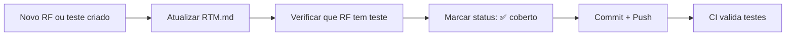

# RNF-07 — Rastreabilidade

> **Métrica:** 100% dos RFs mapeados a testes  
> **Ferramenta de Verificação:** RTM.md (Matriz de Rastreabilidade de Requisitos)  
> **Prioridade:** Alta

---

## 1. Descrição

**Todos os Requisitos Funcionais** devem ser mapeados a pelo menos um teste automatizado, documentados na **Matriz de Rastreabilidade (RTM.md)**. Cada RF deve ter um **diagrama UML de sequência** associado.

---

## 2. Critérios de Verificação

| # | Critério | Tipo |
|---|----------|------|
| CV-01 | RTM.md criado e versionado no repositório (`docs/RTM.md`) | Obrigatório |
| CV-02 | Todos os 11 RFs mapeados na RTM | Obrigatório |
| CV-03 | Cada RF tem pelo menos 1 classe de teste associada | Obrigatório |
| CV-04 | Tipo de teste identificado para cada mapeamento (integração, caixa branca, caixa preta, parametrizado) | Obrigatório |
| CV-05 | Status de cobertura atualizado (coberto/pendente) | Obrigatório |
| CV-06 | Diagrama UML de sequência para cada RF principal | Obrigatório |

---

## 3. Estrutura da RTM

### 3.1 Formato da Tabela

| RF | Descrição | Classe(s) de Teste | Tipo de Teste | Status |
|----|-----------|---------------------|---------------|--------|
| RF-01 | Cadastro de Usuário | `UserRepositoryIT`, `UserServiceTest`, `AuthControllerTest` | Integração + Caixa Branca + E2E | ✅ |
| RF-02 | Login | `UserRepositoryIT`, `UserServiceTest`, `AuthControllerTest` | Integração + Caixa Branca + E2E | ✅ |
| RF-03 | Logout | `AuthControllerTest` | E2E | ✅ |
| RF-04 | Criar Livro | `BookRepositoryIT`, `BookServiceTest`, `BookValidatorTest`, `BookControllerTest`, `BookValidationParamTest` | Integração + Caixa Branca + E2E + Parametrizado | ✅ |
| RF-05 | Listar Livros | `BookRepositoryIT`, `BookServiceTest`, `BookControllerTest` | Integração + Caixa Branca + E2E | ✅ |
| RF-06 | Buscar Livro | `BookRepositoryIT`, `BookServiceTest`, `BookControllerTest` | Integração + Caixa Branca + E2E | ✅ |
| RF-07 | Editar Livro | `BookRepositoryIT`, `BookServiceTest`, `BookControllerTest` | Integração + Caixa Branca + E2E | ✅ |
| RF-08 | Excluir Livro | `BookRepositoryIT`, `BookServiceTest`, `BookControllerTest` | Integração + Caixa Branca + E2E | ✅ |
| RF-09 | Detalhes do Livro | `BookRepositoryIT`, `BookServiceTest`, `BookControllerTest` | Integração + Caixa Branca + E2E | ✅ |
| RF-10 | Consulta de CEP (API) | `CepLookupServiceIT`, `CepFormatParamTest`, `AuthControllerTest` | VCR (WireMock) + Parametrizado + E2E | ✅ |
| RF-11 | Validação de Dados | `BookValidatorTest`, `BookValidationParamTest`, `CepFormatParamTest`, `BookControllerTest`, `AuthControllerTest` | Caixa Branca + Parametrizado + E2E | ✅ |

### 3.2 Resumo de Cobertura

| Métrica | Valor |
|---------|-------|
| **Total de RFs** | 11 |
| **RFs cobertos** | 11 (100%) |
| **Classes de teste** | ~12 |
| **Tipos de teste** | 5 (Integração, Caixa Branca, Caixa Preta/E2E, Parametrizado, VCR) |

---

## 4. Diagramas UML de Sequência

Cada RF principal deve ter um diagrama Mermaid no arquivo `docs/requisitos/funcionais/RF-XX.md`. Os diagramas estão documentados nos arquivos individuais de cada RF.

### Índice de Diagramas

| RF | Diagrama | Localização |
|----|----------|-------------|
| RF-01 | Cadastro → Validação → BCrypt → MongoDB | `docs/requisitos/funcionais/RF-01.md` |
| RF-02 | Login → Spring Security → BCrypt.matches → Sessão | `docs/requisitos/funcionais/RF-02.md` |
| RF-03 | Logout → Invalidar Sessão → Deletar Cookie | `docs/requisitos/funcionais/RF-03.md` |
| RF-04 | Criar Livro → Validar → Salvar no MongoDB | `docs/requisitos/funcionais/RF-04.md` |
| RF-05 | Listar → findByUserId → Renderizar | `docs/requisitos/funcionais/RF-05.md` |
| RF-06 | Buscar → Regex Query → Filtrar | `docs/requisitos/funcionais/RF-06.md` |
| RF-07 | Editar → Verificar Propriedade → Atualizar | `docs/requisitos/funcionais/RF-07.md` |
| RF-08 | Excluir → Confirmar → Deletar | `docs/requisitos/funcionais/RF-08.md` |
| RF-09 | Detalhes → Verificar Propriedade → Exibir | `docs/requisitos/funcionais/RF-09.md` |
| RF-10 | CEP → ViaCEP API → Preencher Endereço | `docs/requisitos/funcionais/RF-10.md` |
| RF-11 | Dados → Validar → Erros ou Prosseguir | `docs/requisitos/funcionais/RF-11.md` |

---

## 5. Fluxo de Atualização da RTM

> [!IMPORTANT]
> A RTM deve ser **atualizada junto com o código** — sempre que um novo teste é criado ou um RF é modificado.

---

## 6. RFs Impactados

Todos os 11 RFs são diretamente impactados — cada um precisa estar presente na RTM.

---

## 7. Conexão com outros RNFs

| RNF | Relação |
|-----|---------|
| **RNF-01 (Testabilidade)** | RTM documenta os testes que garantem testabilidade |
| **RNF-03 (CI/CD)** | Pipeline valida que os testes mapeados na RTM passam |
| **RNF-02 (Qualidade)** | RTM demonstra cobertura organizada e intencional |

> [!TIP]
> **Para a oral:** "A RTM é o documento que prova que nenhum requisito ficou sem teste. O professor pode verificar que cada RF tem pelo menos um teste automatizado, e cada teste está identificado com seu tipo (integração, caixa branca, caixa preta ou parametrizado). Isso garante rastreabilidade bidirecional: do requisito ao teste e do teste ao requisito."
