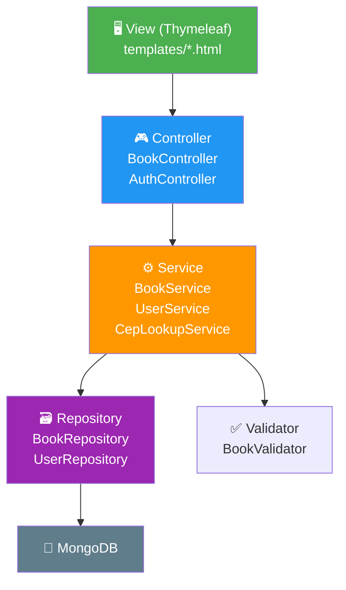

# RNF-08 — Manutenibilidade

> **Métrica:** Código limpo, padrão MVC, baixo acoplamento  
> **Ferramenta de Verificação:** SonarQube + Code Review  
> **Prioridade:** Média

---

## 1. Descrição

O código deve seguir **boas práticas de engenharia de software**: arquitetura MVC, princípios SOLID, código limpo e baixo acoplamento entre camadas. Isso facilita a **manutenção**, **evolução** e **compreensão** do projeto.

---

## 2. Critérios de Verificação

| # | Critério | Tipo |
|---|----------|------|
| CV-01 | Arquitetura MVC respeitada (Controller → Service → Repository) | Obrigatório |
| CV-02 | Nenhum acesso direto ao Repository pelo Controller | Obrigatório |
| CV-03 | Validação isolada em classe dedicada (`BookValidator`) | Obrigatório |
| CV-04 | DTOs usados para transferência de dados (sem expor entidades diretamente) | Obrigatório |
| CV-05 | Métodos com complexidade ciclomática ≤ 10 | Desejável |
| CV-06 | Classes com ≤ 300 linhas | Desejável |
| CV-07 | Code smells no SonarCloud: rating A | Desejável |
| CV-08 | Duplicação de código < 3% | Desejável |

---

## 3. Arquitetura MVC — Fluxo de Dependências



### Regras de Dependência

| Camada | Pode acessar | NÃO pode acessar |
|--------|-------------|-------------------|
| **Controller** | Service, DTO | Repository, Model (diretamente) |
| **Service** | Repository, Validator, Model, DTO | Controller, View |
| **Repository** | Model | Service, Controller |
| **Validator** | DTO | Repository, Controller |
| **View** | DTO (via Model attributes) | Service, Repository |

---

## 4. Princípios SOLID Aplicados

| Princípio | Aplicação no projeto |
|-----------|---------------------|
| **S — Single Responsibility** | `BookValidator` só valida; `BookService` só orquestra; `BookRepository` só persiste |
| **O — Open/Closed** | Novos status de leitura adicionados via Enum sem alterar lógica existente |
| **L — Liskov Substitution** | `UserService` implementa `UserDetailsService` do Spring Security |
| **I — Interface Segregation** | Interfaces de Repository específicas (não um DAO genérico) |
| **D — Dependency Inversion** | Services dependem de interfaces (`BookRepository`), não de implementações |

---

## 5. Padrões de Código

### 5.1 Nomenclatura

| Elemento | Convenção | Exemplo |
|----------|----------|---------|
| Classes | PascalCase | `BookService`, `AuthController` |
| Métodos | camelCase, verbo no infinitivo | `criarLivro()`, `buscarPorId()` |
| Variáveis | camelCase | `statusLeitura`, `userId` |
| Constantes | UPPER_SNAKE_CASE | `VIACEP_URL` |
| Packages | lowercase | `com.biblioteca.service` |
| Testes | `deve` + comportamento esperado | `deveSalvarERecuperarLivro()` |

### 5.2 Estrutura de Métodos de Teste

```java
@Test
void deveCriarLivroComDadosValidos() {
    // Arrange (Given)
    BookDTO dto = new BookDTO("Dom Casmurro", "Machado de Assis", "978-...");

    // Act (When)
    Book resultado = bookService.criarLivro(dto, userId);

    // Assert (Then)
    assertNotNull(resultado.getId());
    assertEquals("Dom Casmurro", resultado.getTitulo());
}
```

### 5.3 Tratamento de Exceções

```java
// Exceções customizadas em vez de RuntimeException genérico
public class CepNaoEncontradoException extends RuntimeException { ... }
public class EmailDuplicadoException extends RuntimeException { ... }
public class LivroNaoEncontradoException extends RuntimeException { ... }

// Handler centralizado
@ControllerAdvice
public class GlobalExceptionHandler {
    @ExceptionHandler(LivroNaoEncontradoException.class)
    public String handleNotFound(Model model) {
        model.addAttribute("erro", "Recurso não encontrado");
        return "error/404";
    }
}
```

---

## 6. Métricas do SonarCloud

| Métrica | Alvo | O que mede |
|---------|------|-----------|
| **Complexidade ciclomática** | ≤ 10 por método | Número de caminhos lógicos (if, for, while) |
| **Cognitive complexity** | ≤ 15 por método | Dificuldade de entendimento |
| **Duplicação** | < 3% | Código repetido (copy-paste) |
| **Dívida técnica** | ≤ 30 min | Tempo estimado para corrigir code smells |

---

## 7. Boas Práticas de Manutenibilidade

| Prática | Exemplo no projeto |
|---------|-------------------|
| **Template reutilizado** | `books/form.html` serve para criação (RF-04) e edição (RF-07) |
| **Validator separado** | `BookValidator` isolado do `BookService` |
| **DTOs** | `BookDTO` e `UserDTO` separam representação de persistência |
| **Enum** | `StatusLeitura` em vez de strings mágicas |
| **Exceções customizadas** | Classes de exceção específicas para cada cenário |
| **@ControllerAdvice** | Tratamento de erros centralizado |

---

## 8. RFs Impactados

Todos os RFs são impactados — a manutenibilidade se aplica a todo o código-fonte.

---

## 9. Conexão com outros RNFs

| RNF | Relação |
|-----|---------|
| **RNF-01 (Testabilidade)** | Código bem separado é mais fácil de testar |
| **RNF-02 (Qualidade)** | SonarCloud mede code smells e complexidade |
| **RNF-03 (CI/CD)** | Code review nos PRs antes de merge |

> [!TIP]
> **Para a oral:** "Manutenibilidade é sobre o futuro — código que outro desenvolvedor consegue entender e modificar sem introduzir bugs. No nosso projeto, isso se traduz em: separação de responsabilidades (MVC + Validator separado), nomenclatura consistente, exceções customizadas e DTOs que isolam a representação da persistência."
