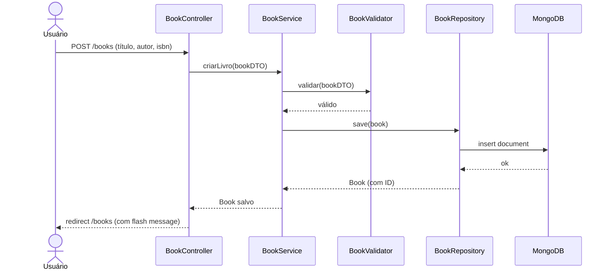

# 📚 Biblioteca Pessoal — Documento de Planejamento

> **Disciplina:** Qualidade de Software  
> **Equipe:** Trio  
> **Abordagem:** Spec-Driven Development  
> **Data:** Maio/2026

---

## 1. Visão Geral do Projeto

Aplicação web completa para **cadastro e gerenciamento de livros** de uma biblioteca pessoal, com **autenticação de usuários**. O foco principal é **qualidade e testabilidade**, não apenas funcionalidade.

### Escopo
- CRUD completo de livros
- Cadastro e autenticação de usuários
- Gerenciamento de sessão
- Interface web responsiva
- Integração com API externa (ex: Open Library API para buscar dados de livros por ISBN)
- Pipeline de qualidade automatizado

---

## 2. Requisitos Funcionais (RF)

| ID | Requisito | Descrição | Prioridade |
|----|-----------|-----------|------------|
| **RF-01** | Cadastro de Usuário | Criar conta com nome, email e senha | Alta |
| **RF-02** | Login | Autenticação via email/senha com criação de sessão | Alta |
| **RF-03** | Logout | Encerrar sessão do usuário | Alta |
| **RF-04** | Criar Livro | Cadastrar livro com título, autor, ISBN, gênero, ano e status de leitura | Alta |
| **RF-05** | Listar Livros | Exibir todos os livros do usuário autenticado | Alta |
| **RF-06** | Buscar Livro | Filtrar livros por título, autor ou gênero | Média |
| **RF-07** | Editar Livro | Atualizar dados de um livro existente | Alta |
| **RF-08** | Excluir Livro | Remover livro da biblioteca | Alta |
| **RF-09** | Detalhes do Livro | Visualizar informações completas de um livro | Média |
| **RF-10** | Busca por ISBN (API) | Preencher dados do livro automaticamente via Open Library API | Média |
| **RF-11** | Validação de Dados | Validar campos obrigatórios e formatos (ex: ISBN) | Alta |

> [!IMPORTANT]
> O **RF-10** (Busca por ISBN) existe para justificar o uso de **WireMock/VCR** — sem uma chamada a API externa, não haveria motivo para essa ferramenta.

---

## 3. Requisitos Não-Funcionais (RNF)

| ID | Requisito | Descrição | Métrica | Ferramenta de Verificação |
|----|-----------|-----------|---------|---------------------------|
| **RNF-01** | Testabilidade | Cobertura mínima de 80% | ≥ 80% linhas cobertas | JaCoCo |
| **RNF-02** | Qualidade de Código | Zero bugs críticos, zero vulnerabilidades | Quality Gate pass | SonarQube |
| **RNF-03** | CI/CD | Build e testes automatizados a cada push | Pipeline verde | GitHub Actions |
| **RNF-04** | Responsividade | Interface funcional em desktop e mobile | Layouts adaptáveis | Testes manuais + CSS |
| **RNF-05** | Segurança | Senhas hasheadas, sessão segura | BCrypt + HttpOnly cookies | Spring Security |
| **RNF-06** | Performance | Resposta da API < 500ms | Tempo de resposta | Testes de integração |
| **RNF-07** | Rastreabilidade | 100% dos RFs mapeados a testes | RTM completa | RTM.md |
| **RNF-08** | Manutenibilidade | Código limpo, padrão MVC | Baixo acoplamento | SonarQube + Code Review |

### Como RNFs conversam com RFs (importante para a oral)

```
RF-01 (Cadastro) ──► RNF-05 (Segurança): senha deve ser hasheada com BCrypt
RF-02 (Login)    ──► RNF-05 (Segurança): sessão com cookie HttpOnly
RF-04 (Criar)    ──► RNF-01 (Testabilidade): testado com Testcontainers (banco real)
RF-10 (ISBN API) ──► RNF-01 (Testabilidade): testado com WireMock/VCR (sem mock)
RF-11 (Validação)──► RNF-01 (Testabilidade): testes parametrizados (@CsvSource)
TODOS os RFs     ──► RNF-07 (Rastreabilidade): mapeados no RTM.md
TODOS os RFs     ──► RNF-03 (CI/CD): validados automaticamente no pipeline
```

---

## 4. Stack Tecnológica — Ferramentas e Justificativas

> [!TIP]
> Cada escolha abaixo inclui **"Por que SIM"** e **"Por que NÃO a alternativa"** — exatamente o que será perguntado na chamada oral.

### 4.1 Backend: Spring Boot 3.x (Java 17+)

| | Detalhe |
|---|---------|
| **Por que SIM** | Framework maduro, ecossistema vasto (Security, Data, Web), suporte nativo a Testcontainers desde v3.1, convenção sobre configuração reduz boilerplate |
| **Por que não Node.js/Express** | Java oferece tipagem forte (menos bugs em runtime), ecossistema de testes mais maduro para o contexto acadêmico (JUnit 5, JaCoCo, SonarQube) |
| **Por que não Quarkus/Micronaut** | Spring Boot é o padrão da indústria e da academia, maior base de documentação, o projeto não exige tempos de startup ultra-rápidos |

### 4.2 Banco de Dados: MongoDB 7.0

| | Detalhe |
|---|---------|
| **Por que SIM** | Modelo de documento JSON se alinha naturalmente com a entidade "Livro" (metadados variáveis: tags, notas, edições). Schema flexível permite evolução sem migrações. Integração nativa com Spring Data MongoDB |
| **Por que não PostgreSQL** | Embora robusto, o modelo relacional exigiria JOINs desnecessários para um domínio simples. MongoDB simplifica o mapeamento objeto→documento. O projeto não tem relacionamentos N:N complexos |
| **Por que não H2 (in-memory)** | H2 é SQL e não reflete o banco real em testes. Com Testcontainers, usamos MongoDB real nos testes — eliminando discrepâncias |
| **Conexão com RNF** | Suporta RNF-01 (Testcontainers roda MongoDB real) e RNF-06 (consultas rápidas em documentos) |

### 4.3 Arquitetura: MVC (Model-View-Controller)

| | Detalhe |
|---|---------|
| **Por que SIM** | Separação clara de responsabilidades (Controller→Service→Repository), alinhamento direto com Spring Boot, ideal para CRUD com complexidade moderada |
| **Por que não Hexagonal/Clean** | Over-engineering para o escopo do projeto. Hexagonal adiciona camadas de abstração (Ports, Adapters) que não se justificam em um CRUD. MVC já garante baixo acoplamento com menos boilerplate |
| **Por que não Monolítico sem camadas** | Violaria princípios SOLID, dificultaria testabilidade e manutenção |

### 4.4 Frontend: Thymeleaf (Server-Side Rendering)

| | Detalhe |
|---|---------|
| **Por que SIM** | Integração nativa com Spring Boot (mesmo projeto, mesmo deploy), gerenciamento de sessão simplificado via `HttpSession` + cookies, sem necessidade de API REST separada + CORS + JWT |
| **Por que não React/Angular (SPA)** | Adicionaria complexidade arquitetural (2 projetos separados, JWT, CORS), foge do foco em qualidade do backend. Thymeleaf mantém o foco no que importa: testes e qualidade |
| **Por que não JSP** | Tecnologia legada, Thymeleaf é o padrão moderno do Spring com "natural templates" (HTML válido mesmo sem servidor) |
| **Responsividade** | Bootstrap 5 para CSS responsivo — amplamente documentado, sem necessidade de build tools para CSS |

### 4.5 Testes de Persistência: Testcontainers

| | Detalhe |
|---|---------|
| **Por que SIM** | Roda uma instância **real** de MongoDB via Docker durante os testes. Elimina discrepâncias entre teste e produção. Atende à regra de "zero mocks" |
| **Por que não banco embarcado (Flapdoodle/Embedded Mongo)** | Flapdoodle foi descontinuado e não suporta MongoDB 7.0+. Embedded databases não replicam 100% do comportamento real |
| **Por que não mocks do Repository** | **Proibido pelo professor.** Além disso, mocks não validam queries reais contra o banco |

### 4.6 Testes de API Externa: WireMock (padrão VCR)

| | Detalhe |
|---|---------|
| **Por que SIM** | Implementa o padrão VCR (Record & Playback): grava chamadas reais à Open Library API em arquivos JSON ("cassettes") e reproduz nas execuções seguintes. Testes determinísticos sem depender de rede |
| **Por que não Mockito/mocks manuais** | **Proibido pelo professor.** WireMock roda um servidor HTTP real, não é um mock — é um stub baseado em gravações reais |
| **Por que não OkHttp MockWebServer** | WireMock tem integração nativa com Spring Boot (`wiremock-spring-boot`), suporte a recording, e ecossistema mais maduro |
| **Conexão com RF** | Viabiliza RF-10 (busca ISBN) sem depender de internet nos testes |

### 4.7 Cobertura: JaCoCo

| | Detalhe |
|---|---------|
| **Por que SIM** | Padrão da indústria Java para cobertura, integração nativa com Maven e SonarQube, gera relatórios XML/HTML |
| **Por que não Cobertura (ferramenta)** | Projeto abandonado, não suporta Java 17+. JaCoCo é mantido ativamente |

### 4.8 Qualidade: SonarQube (via SonarCloud)

| | Detalhe |
|---|---------|
| **Por que SIM** | Análise estática de código (bugs, vulnerabilidades, code smells), integração com JaCoCo para visualizar cobertura, Quality Gates configuráveis |
| **Por que SonarCloud e não self-hosted** | SonarCloud é gratuito para projetos open-source, sem necessidade de infraestrutura própria, integração direta com GitHub |
| **Por que não apenas Checkstyle/PMD** | SonarQube engloba tudo (Checkstyle, PMD, FindBugs) em uma dashboard única com histórico |

### 4.9 CI/CD: GitHub Actions

| | Detalhe |
|---|---------|
| **Por que SIM** | Integrado ao GitHub (onde o repositório já está), gratuito para projetos públicos, suporte nativo a Docker (necessário para Testcontainers) |
| **Por que não Jenkins** | Exige servidor próprio. GitHub Actions é serverless e zero config de infra |
| **Por que não GitLab CI** | O repositório está no GitHub — usar GitLab CI exigiria migração ou mirror |

### 4.10 Build: Maven

| | Detalhe |
|---|---------|
| **Por que SIM** | Gerenciamento de dependências declarativo (pom.xml), ciclo de vida padronizado (`clean → compile → test → package`), integração nativa com JaCoCo e SonarQube |
| **Por que não Gradle** | Maven é mais verboso porém mais previsível e amplamente documentado em contextos acadêmicos. Gradle tem curva de aprendizado maior com Groovy/Kotlin DSL |

---

## 5. Estrutura do Projeto

```
biblioteca-pessoal/
├── .github/
│   └── workflows/
│       └── ci.yml                    # Pipeline GitHub Actions
├── src/
│   ├── main/
│   │   ├── java/com/biblioteca/
│   │   │   ├── BibliotecaApplication.java
│   │   │   ├── config/
│   │   │   │   ├── SecurityConfig.java       # Spring Security
│   │   │   │   └── MongoConfig.java          # Configuração MongoDB
│   │   │   ├── controller/
│   │   │   │   ├── AuthController.java       # Login/Registro
│   │   │   │   ├── BookController.java       # CRUD Livros
│   │   │   │   └── HomeController.java       # Página inicial
│   │   │   ├── model/
│   │   │   │   ├── User.java                 # Entidade Usuário
│   │   │   │   └── Book.java                 # Entidade Livro
│   │   │   ├── repository/
│   │   │   │   ├── UserRepository.java       # Spring Data Mongo
│   │   │   │   └── BookRepository.java
│   │   │   ├── service/
│   │   │   │   ├── UserService.java          # Lógica de negócio
│   │   │   │   ├── BookService.java
│   │   │   │   ├── BookValidator.java        # Validações
│   │   │   │   └── IsbnLookupService.java    # Chamada Open Library
│   │   │   └── dto/
│   │   │       ├── BookDTO.java
│   │   │       └── UserDTO.java
│   │   ├── resources/
│   │   │   ├── application.yml
│   │   │   ├── templates/                    # Thymeleaf
│   │   │   │   ├── layout.html
│   │   │   │   ├── home.html
│   │   │   │   ├── login.html
│   │   │   │   ├── register.html
│   │   │   │   ├── books/
│   │   │   │   │   ├── list.html
│   │   │   │   │   ├── form.html
│   │   │   │   │   └── detail.html
│   │   │   └── static/
│   │   │       ├── css/style.css
│   │   │       └── js/app.js
│   ├── test/
│   │   ├── java/com/biblioteca/
│   │   │   ├── integration/                  # Testes de Integração
│   │   │   │   ├── BookRepositoryIT.java     # Testcontainers
│   │   │   │   ├── UserRepositoryIT.java
│   │   │   │   └── IsbnLookupServiceIT.java  # WireMock/VCR
│   │   │   ├── controller/                   # Caixa Preta (E2E)
│   │   │   │   ├── BookControllerTest.java
│   │   │   │   └── AuthControllerTest.java
│   │   │   ├── service/                      # Caixa Branca
│   │   │   │   ├── BookServiceTest.java
│   │   │   │   ├── BookValidatorTest.java
│   │   │   │   └── UserServiceTest.java
│   │   │   └── parametrized/                 # Testes Parametrizados
│   │   │       ├── BookValidationParamTest.java
│   │   │       └── IsbnFormatParamTest.java
│   │   └── resources/
│   │       └── wiremock/                     # "Cassettes" VCR
│   │           ├── mappings/
│   │           └── __files/
├── docs/
│   ├── RTM.md                                # Matriz de Rastreabilidade
│   └── diagramas/                            # UML de Sequência
├── README.md
├── pom.xml
├── sonar-project.properties
└── docker-compose.yml                        # MongoDB local
```

---

## 6. Estratégia de Testes (Detalhada)

### 6.1 Mapa de Tipos de Teste por Camada

| Camada | Tipo de Teste | Ferramenta | Exemplo |
|--------|---------------|------------|---------|
| **Repository** | Integração | Testcontainers + MongoDB | `BookRepositoryIT`: CRUD real no banco |
| **Service** | Caixa Branca (unitário) | JUnit 5 + Testcontainers | `BookServiceTest`: lógica de negócio com banco real |
| **Service** | Parametrizado | JUnit 5 `@ParameterizedTest` | `BookValidationParamTest`: múltiplos cenários de validação |
| **Service (API)** | Integração VCR | WireMock | `IsbnLookupServiceIT`: replay de chamadas à Open Library |
| **Controller** | Caixa Preta (E2E) | SpringBootTest + TestRestTemplate | `BookControllerTest`: requisições HTTP reais |

### 6.2 Exemplo Conceitual: Testes Parametrizados

```java
@ParameterizedTest(name = "ISBN \"{0}\" → válido={1}")
@CsvSource({
    "978-3-16-148410-0, true",    // ISBN-13 válido
    "0-306-40615-2, true",        // ISBN-10 válido
    "123, false",                  // Muito curto
    "'', false",                   // Vazio
    "978-0-00-000000-0, false"    // Checksum inválido
})
void deveValidarFormatoIsbn(String isbn, boolean esperado) {
    assertEquals(esperado, validator.isValidIsbn(isbn));
}
```

### 6.3 Exemplo Conceitual: Testcontainers (sem mocks)

```java
@Testcontainers
@SpringBootTest
class BookRepositoryIT {

    @Container
    static MongoDBContainer mongo = new MongoDBContainer("mongo:7.0");

    @DynamicPropertySource
    static void mongoProps(DynamicPropertyRegistry registry) {
        registry.add("spring.data.mongodb.uri", mongo::getReplicaSetUrl);
    }

    @Autowired
    private BookRepository bookRepository;

    @Test
    void deveSalvarERecuperarLivro() {
        Book livro = new Book("Dom Casmurro", "Machado de Assis", "978-...");
        bookRepository.save(livro);
        Optional<Book> encontrado = bookRepository.findByTitulo("Dom Casmurro");
        assertTrue(encontrado.isPresent());
    }
}
```

### 6.4 Exemplo Conceitual: WireMock/VCR

```java
@SpringBootTest
@EnableWireMock
class IsbnLookupServiceIT {

    @InjectWireMock
    private WireMockServer wireMock;

    // 1ª execução: grava chamada real → salva em /wiremock/mappings/
    // Execuções seguintes: reproduz do arquivo (sem rede)

    @Test
    void deveBuscarLivroPorIsbn() {
        // WireMock serve a resposta gravada da Open Library API
        BookInfo info = isbnLookupService.buscarPorIsbn("978-0-14-028329-7");
        assertEquals("The Great Gatsby", info.getTitle());
    }
}
```

### 6.5 Como os Tipos de Teste Conversam (para a oral)

```
Testes Parametrizados ──► validam REGRAS DE NEGÓCIO (Caixa Branca)
         │                 com múltiplos cenários de entrada
         ▼
Testcontainers ──────► validam PERSISTÊNCIA REAL (Integração)
         │              sem mocks, com MongoDB real em Docker
         ▼
WireMock/VCR ────────► validam INTEGRAÇÕES EXTERNAS (Integração)
         │              com gravações reais, sem depender de rede
         ▼
Controller Tests ────► validam FLUXO COMPLETO (Caixa Preta / E2E)
         │              requisição HTTP → controller → service → banco
         ▼
JaCoCo ──────────────► MEDE tudo acima (≥ 80%)
         ▼
SonarQube ───────────► ANALISA qualidade além de cobertura
         ▼
GitHub Actions ──────► AUTOMATIZA tudo a cada push
```

---

## 7. Pipeline CI/CD (GitHub Actions)

```yaml
# .github/workflows/ci.yml (conceitual)
name: CI Pipeline
on: [push, pull_request]

jobs:
  build-and-test:
    runs-on: ubuntu-latest
    steps:
      - uses: actions/checkout@v4
      - uses: actions/setup-java@v4
        with: { java-version: '17', distribution: 'temurin', cache: 'maven' }

      - name: Build & Test (Testcontainers + WireMock)
        run: mvn clean verify

      - name: SonarCloud Analysis
        uses: SonarSource/sonarcloud-github-action@master
        env:
          GITHUB_TOKEN: ${{ secrets.GITHUB_TOKEN }}
          SONAR_TOKEN: ${{ secrets.SONAR_TOKEN }}
```

**Fluxo:** Push → Build → Testes (Testcontainers + WireMock) → JaCoCo Report → SonarCloud → Quality Gate

---

## 8. Documentação Obrigatória

### 8.1 RTM.md (Matriz de Rastreabilidade)

Cada RF deve ter:
- ID do requisito
- Descrição
- Classe(s) de teste que o cobrem
- Tipo de teste (unitário, integração, E2E, parametrizado)
- Status (coberto/pendente)
- Diagrama UML de sequência

Exemplo de entrada:

| RF | Descrição | Testes | Tipo | Status |
|----|-----------|--------|------|--------|
| RF-04 | Criar Livro | `BookRepositoryIT.deveSalvarLivro()`, `BookControllerTest.deveCriarLivro()`, `BookValidationParamTest` | Integração + E2E + Parametrizado | ✅ |

### 8.2 Diagramas UML de Sequência

Um diagrama para cada RF principal. Exemplo para RF-04 (Criar Livro):



### 8.3 README.md

Deve conter:
- Descrição do projeto
- Tecnologias e justificativas (resumo)
- Pré-requisitos (Java 17, Docker, Maven)
- Como rodar (`docker-compose up` + `mvn spring-boot:run`)
- Como rodar os testes (`mvn verify`)
- Como ver cobertura (link JaCoCo)
- Link do SonarCloud
- Estrutura do projeto
- Membros da equipe

---

## 9. Dependências Maven (pom.xml)

```xml
<!-- Core -->
spring-boot-starter-web
spring-boot-starter-data-mongodb
spring-boot-starter-security
spring-boot-starter-thymeleaf
spring-boot-starter-validation

<!-- Frontend -->
bootstrap (via WebJars) 5.3.x

<!-- Testes -->
spring-boot-starter-test
spring-boot-testcontainers
org.testcontainers:mongodb
org.testcontainers:junit-jupiter
wiremock-spring-boot
junit-jupiter-params          <!-- @ParameterizedTest -->

<!-- Qualidade -->
jacoco-maven-plugin
sonar-maven-plugin
```

---

## 10. Divisão de Tarefas (Trio)

### Fase 1 — Setup (Semana 1)
| Tarefa | Responsável |
|--------|-------------|
| Criar repositório GitHub + branch strategy | Membro A |
| Inicializar projeto Spring Boot + pom.xml | Membro B |
| Configurar docker-compose.yml (MongoDB) | Membro C |
| Configurar GitHub Actions (CI básico) | Membro A |

### Fase 2 — Backend (Semanas 2-3)
| Tarefa | Responsável |
|--------|-------------|
| Model + Repository (User, Book) | Membro A |
| Service layer (BookService, UserService, Validator) | Membro B |
| Controller layer + Spring Security | Membro C |
| IsbnLookupService (Open Library API) | Membro B |

### Fase 3 — Frontend (Semana 3)
| Tarefa | Responsável |
|--------|-------------|
| Templates Thymeleaf (layout, home, login) | Membro C |
| Templates de livros (list, form, detail) | Membro A |
| CSS responsivo + UX | Membro C |

### Fase 4 — Testes (Semanas 4-5)
| Tarefa | Responsável |
|--------|-------------|
| Testes de integração - Repository (Testcontainers) | Membro A |
| Testes WireMock/VCR (IsbnLookupService) | Membro B |
| Testes parametrizados (validações) | Membro B |
| Testes caixa branca (Service) | Membro A |
| Testes caixa preta (Controller E2E) | Membro C |

### Fase 5 — Qualidade e Docs (Semana 5-6)
| Tarefa | Responsável |
|--------|-------------|
| Configurar JaCoCo + SonarCloud | Membro A |
| Pipeline CI completo (build+test+sonar) | Membro A |
| RTM.md com diagramas UML | Membro B |
| README.md detalhado | Membro C |
| Revisão de cobertura (≥ 80%) | Todos |

---

## 11. Checklist de Entrega

- [ ] Repositório GitHub com histórico de commits organizado
- [ ] Código-fonte completo (backend + frontend)
- [ ] `README.md` detalhado
- [ ] `RTM.md` com diagramas UML de sequência para cada RF
- [ ] Cobertura JaCoCo ≥ 80% (relatório gerado)
- [ ] SonarCloud configurado e Quality Gate passando
- [ ] GitHub Actions pipeline verde (build + test + sonar)
- [ ] Zero mocks — apenas Testcontainers e WireMock
- [ ] Todos os RFs cobertos por pelo menos um teste
- [ ] Testes parametrizados presentes
- [ ] Testes caixa branca e caixa preta identificados

---

## Open Questions

> [!IMPORTANT]
> **Perguntas para alinhar com o trio antes de começar:**

1. **Nome do repositório GitHub** — sugestão: `biblioteca-pessoal` ou `personal-library`?
2. **Qual API externa usar para ISBN?** — Sugiro [Open Library API](https://openlibrary.org/dev/docs/api/books) (gratuita, sem chave). Outra opção seria Google Books API (requer API key).
3. **Branch strategy** — `main` + `develop` + feature branches, ou apenas `main` + feature branches?
4. **SonarCloud vs SonarQube self-hosted?** — SonarCloud é mais simples (gratuito para open-source). O professor exige self-hosted?
5. **Escopo do frontend** — Apenas funcional ou querem investir em UX premium (animações, dark mode)?
6. **Distribuição dos membros** — A tabela da Seção 10 é uma sugestão. Quem fica com o quê?
